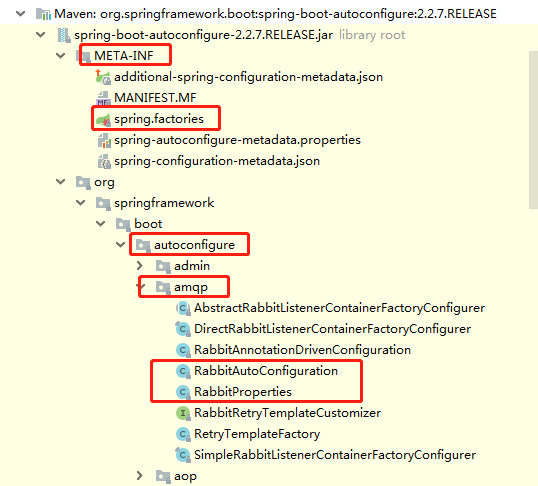
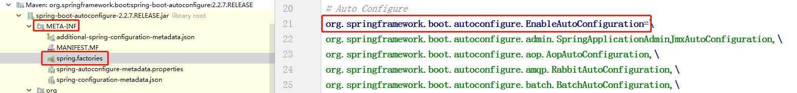
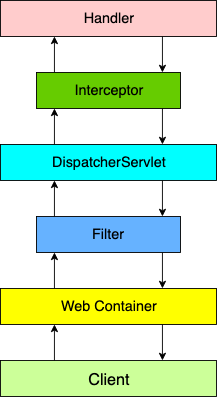
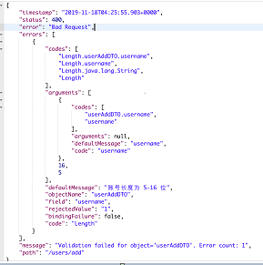
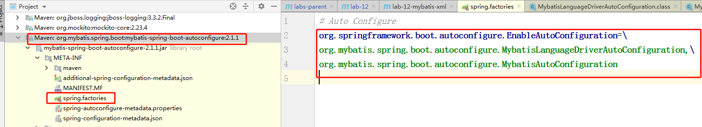
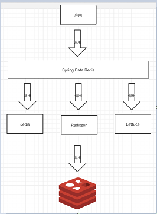
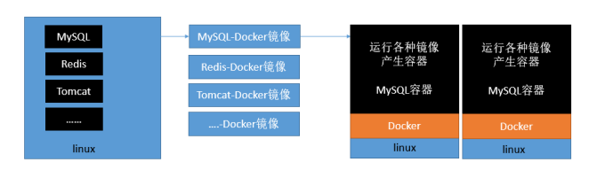

dokSpring boot

- 简化Spring应用开发的一个框架； 
- 整个Spring技术栈的一个大整合； 
- J2EE开发的一站式解决方案； 

```java
@SpringBootApplication
public class StudyApplication {
    public static void main(String[] args) {
        SpringApplication.run(StudyApplication.class, args);
    }
}
```

## 基础

### 自动配置原理

```java
@SpringBootApplication //标注主配置类
-@SpringBootConfiguration//封装了@Configuration，配置类并注入容器
--@Configuration
-@EnableAutoConfiguration//开启自动配置功能
--@AutoConfigurationPackage//扫描主配置类包及子包下的类
---@Import(AutoConfigurationPackages.Registrar.class)
--@Import(AutoConfigurationImportSelector.class)//导入自动配置选择器，扫描所有jar包下 `META-INF` 目录下的 `spring.factories` 文件
-@ComponentScan(excludeFilters =...)//扫描时排除策略
```

#### 概述

自动配置需要解三个问题：

- 满足什么样的**条件**？
- 创建**哪些** `Bean`？
- 创建的`Bean`的**属性**？

在我们引入 `spring-boot-starter-web` 依赖，会创建一个 8080 端口的内嵌 `Tomcat`，同时可以在 `application.yaml` 配置文件中通过 `server.port` 配置项自定义端口。那么这三个问题的答案如下：

- 满足什么样的**条件**：引入了 `spring-boot-starter-web` 依赖。
- 创建**哪些** Bean：内嵌的 Tomcat Bean。
- 创建的 Bean 的**属性**：在`application.yaml` 配置文件配置，具体配置项可看`ServerProperties`类。

```java
@Configuration // <1.1> 声明这是一个 Spring 配置类
@ConditionalOnWebApplication // <2.1>
@EnableConfigurationProperties(ServerProperties.class) // <3.1>
public class  EmbeddedWebServerFactoryCustomizerAutoConfiguration {

	@Configuration // <1.2>
	@ConditionalOnClass({ Tomcat.class, UpgradeProtocol.class })
	public static class TomcatWebServerFactoryCustomizerConfiguration {
		@Bean //声明该方法创建一个 Spring Bean
		public TomcatWebServerFactoryCustomizer tomcatWebServerFactoryCustomizer(
				Environment environment, ServerProperties serverProperties) {
			// <3.2>
			return new TomcatWebServerFactoryCustomizer(environment, serverProperties);
		}
	}
	......
}

```

通过 `@Configuration` 注解的配置类`XXXXAutoConfiguration`，可以解决“创建哪些 Bean”的问题。

> Spring Boot 的`spring-boot-autoconfigure`项目，提供了大量框架的自动配置类。

通过`@Configuration`条件注解，可以解决“满足什么样的条件”的问题。

> Spring Boot 的 `condition`包下，提供了大量的条件注解。

通过`@EnableConfigurationProperties`注解，让 `XXXXProperties` 配置属性类生效（注入容器），可以解决“创建的 Bean 的属性”的问题。

```java
@ConfigurationProperties(prefix = "server", ignoreUnknownFields = true)
public class ServerProperties
		implements EmbeddedServletContainerCustomizer, EnvironmentAware, Ordered {
	private Integer port;
	private String contextPath;
	// ... 省略其它属性
}
```

> 通过 `@ConfigurationProperties` 注解，声明将 `xxxx` 前缀的配置项，设置到 `XXXXProperties `配置属性类中。

#### 自动配置类

在 Spring Boot 的`spring-boot-autoconfigure`项目，提供了大量框架的自动配置。



在我们通过 `SpringApplication#run()`方法，启动 Spring Boot 应用的时候，有个非常重要的组件`SpringFactoriesLoader` 类，会读取每个jar包 `META-INF` 目录下的 `spring.factories` 文件，获得**每个框架定义的需要自动配置的配置类**。



如此，原先 `@Configuration` 注解的配置类，就**升级**成类自动配置类。这样，Spring Boot 在获取到需要自动配置的配置类后，就可以自动创建相应的 Bean，完成自动配置的功能。

#### 条件注解

条件注解并非 Spring Boot 独有，而是在 Spring3.1 版本时，为了满足不同环境注册不同的 `Bean `，引入了`@Profile`注解。

```java
@Configuration
public class DataSourceConfiguration {
    @Bean
    @Profile("DEV")//在测试环境下，我们注册单机 MySQL 的 DataSource Bean。
    public DataSource devDataSource() {
        // ... 单机 MySQL
    }
    
    @Bean
    @Profile("PROD")//在生产环境下，我们注册集群 MySQL 的 DataSource Bean。
    public DataSource prodDataSource() {
        // ... 集群 MySQL
    }
}
```

在 Spring4 版本时，提供了 `@Conditional`注解，用于声明在配置类或者创建  `Bean ` 的方法上，表示需要满足指定条件才能生效。

```java
@Configuration
public class TestConfiguration {
    @Bean
    @Conditional(XXXCondition.class)//XXXCondition 需要我们自己实现 Condition 接口，提供具体的条件实现。
    public Object xxxObject() {
        return new Object();
    }
}
```

Spring Boot 进一步增强，提供了常用的条件注解：

- `@ConditionalOnBean`：当容器里有指定 Bean 的条件下
- `@ConditionalOnMissingBean`：当容器里没有指定 Bean 的情况下
- `@ConditionalOnSingleCandidate`：当指定 Bean 在容器中只有一个，或者虽然有多个但是指定首选 Bean
- `@ConditionalOnClass`：当类路径下有指定类的条件下
- `@ConditionalOnMissingClass`：当类路径下没有指定类的条件下
- `@ConditionalOnProperty`：指定的属性是否有指定的值
- `@ConditionalOnResource`：类路径是否有指定的值
- `@ConditionalOnExpression`：基于 SpEL 表达式作为判断条件
- `@ConditionalOnJava`：基于 Java 版本作为判断条件
- `@ConditionalOnJndi`：在 JNDI 存在的条件下差在指定的位置
- `@ConditionalOnNotWebApplication`：当前项目不是 Web 项目的条件下
- `@ConditionalOnWebApplication`：当前项目是 Web项 目的条件下

#### 配置属性

Spring Boot 约定读取 `application.yaml`、`application.properties` 等配置文件，从而实现创建 Bean 的自定义属性配置，甚至可以搭配 `@ConditionalOnProperty` 注解来取消 Bean 的创建。

#### 内置starter

我们在使用 Spring Boot 时，并不会直接引入 [`spring-boot-autoconfigure`](https://mvnrepository.com/artifact/org.springframework.boot/spring-boot-autoconfigure) 依赖，而是使用 Spring Boot 内置提供的 Starter 依赖。例如说，我们想要使用 SpringMVC 时，引入的是 [`spring-boot-starter-web`](https://mvnrepository.com/artifact/org.springframework.boot/spring-boot-starter-web) 依赖。

因为 Spring Boot 提供的自动配置类，基本都有 `@ConditionalOnClass` 条件注解，判断我们项目中存在指定的类，才会创建对应的 Bean。而拥有指定类的前提，一般是需要我们引入对应框架的依赖。

因此，在我们引入 `spring-boot-starter-web` 依赖时，它会帮我们自动引入相关依赖，从而保证自动配置类能够生效，创建对应的 Bean

Spring Boot 内置了非常多的 Starter，方便我们引入不同框架，并实现自动配置。

#### 自定义starter

在一些场景下，我们需要自己实现自定义 Starter 来达到自动配置的目的。例如说：

- 三方框架并没有提供 Starter，比如说 [Swagger](https://github.com/swagger-api)、[XXL-JOB](https://github.com/xuxueli/xxl-job) 等。
- Spring Boot 内置的 Starter 无法满足自己的需求，比如说 [`spring-boot-starter-jdbc`](https://mvnrepository.com/artifact/org.springframework.boot/spring-boot-starter-jdbc) 不提供多数据源的配置。
- 随着项目越来越大，想要提供适合自己团队的 Starter 来方便配置项目，比如说永辉彩食鲜 [csx-bsf-all](https://gitee.com/yhcsx/csx-bsf-all) 项目。

| 场景                         | 命名规则                            | 示例                                       |
| -------------------------- | ------------------------------- | ---------------------------------------- |
| **Spring Boot 内置** Starter | `spring-boot-starter-{框架}`      | `spring-boot-starter-web`                |
| 框架 **自定义** Starter         | `{框架}-spring-boot-starter`      | [`mybatis-spring-boot-starter`](https://mvnrepository.com/artifact/org.mybatis.spring.boot/mybatis-spring-boot-starter) |
| 公司 **自定义** Starter         | `{公司}-spring-boot-starter-{框架}` |                                          |

重点是：

- 创建`XXXXAutoConfiguration`配置类；
- 创建`XXXXProperties`属性 包装类，并通过`@ConfigurationProperties(prefix = "xxxx")`映射配置文件；
- 在 `resources` 目录下创建，创建 `META-INF` 目录，然后在该目录下创建 [`spring.factories`](https://github.com/YunaiV/SpringBoot-Labs/blob/master/lab-47/yunai-server-spring-boot-starter/src/main/resources/META-INF/spring.factories) 文件，添加自动化配置类为 `XXXXAutoConfiguration`；

## 开发工具

### lombok

[Lombok](https://github.com/rzwitserloot/lombok) 是一个 Java 工具，通过使用其定义的注解，自动生成常见的冗余代码，提升开发效率。

Lombok 的注解非常多，我们逐个来看看。

- @Getter 注解，添加在类或属性上，生成对应的 get 方法。
- @Setter 注解，添加在类或属性上，生成对应的 set 方法。
- @ToString 注解，添加在类上，生成 toString 方法。
- @EqualsAndHashCode 注解，添加在类上，生成 equals 和 hashCode 方法。
- @AllArgsConstructor、@RequiredArgsConstructor、@NoArgsConstructor 注解，添加在类上，为类自动生成对应参数的构造方法。
- @Data 注解，添加在类上，是 5 个 Lombok 注解的组合。
- @CommonsLog、@Flogger、@Log、@JBossLog、@Log4j、@Log4j2、@Slf4j、@Slf4jX 注解，添加在类上，自动为类添加对应的日志支持。
- @Builder 注解，添加在类上，给该类加个构造者模式 Builder 内部类。
- @Synchronized 注解，添加在方法上，添加同步锁。
- @SneakyThrows 注解，添加在方法上，给该方法添加 try catch 代码块。
- @NonNull 注解，添加在方法参数、类属性上，用于自动生成 null 参数检查。若确实是 null 时，抛出 NullPointerException 异常。

常用@Data、@Slf4j、@Builder、@SneakyThrows、@NonNull。

```java
//源码
@SneakyThrows
public static void tryCatch(@NonNull String name, @NonNull String age{}

//编译后
public static void tryCatch(@NonNull String name, @NonNull String age) {
    try {
        if (name == null) {
            throw new NullPointerException("name is marked non-null but is null");
        } else if (age == null) {
            throw new NullPointerException("age is marked non-null but is null");
        }
    } catch (Throwable var3) {
        throw var3;
    }
}、
```

### MapStruct 

`MapSturct` 是一个生成类型安全， 高性能且无依赖的 JavaBean 映射代码的注解处理器。

```java
@Mapper
public interface TargetMapper {
    TargetMapper INSTANCE = Mappers.getMapper(TargetMapper.class);
    @Mappings(value={
	@Mapping(target="abc", source="cba"),
	@Mapping(target="acc", source="cca", qualifiedByName="mapMethodName2"), //定义转换的方法
	@Mapping(target="aaa",  constant="123")  //定义常量	})
    Target source2target(Source source);
}
```

概述：

- 支持maven/gradle/ant工具所构建的项目；
- 在某些情况下，可能需要手动实现从一种类型到另一种类型的特定映射，而MapStruct无法生成这种映射，你可以向映射器中**添加自定义方法**；
- 可以用**多个源对象的数据映射到一个对象**上，也就是说可以同时把A和B的数据复制到C对象中；
- 可以通过引用更新目标对象，默认在复制时会生成新的对象并返回，但有时候可能不需要生成新的对象，只希望它在既有对象上进行复制；
- Bean的字段如果没有提供getter/setter方法也可以进行复制，它会通过实例直接访问属性来达到目的；
- 如果Bean提供了自己的工厂，即通过Builder构造自己，也可以被识别到；
- 获取映射器之后客户端才能调用，获取的方式支持Mappers工厂、CDI依赖注入和Spring依赖注入；
- **类型隐式转换**；
- **嵌套对象自动映射**；
- 在当前映射器中可以调用其他映射器，可以是自定义映射器；
- **集合映射**；
- 流映射；
- 枚举类映射；
- **映射字段控制**：常量，默认值，忽略字段，NULL值检查和处理策略，异常处理；
- 映射配置共享、继承和反向映射；
- 装饰器映射，也就是在映射前后做一些自定义操作；
- 提供SPI接口，可以修改框架的部分实现；

### fastJson

需要写一个配置类WebConfig实现WebMvcConfigurer接口，然后重写configureMessageConverters方法。

```java
@Configuration
public class CustomWebConfig implements WebMvcConfigurer {
    /**
     * description: 添加JSON消息转换器
     * (1)源码分析可知，返回json的过程为：Controller调用结束后返回一个数据对象，for循环遍历conventers，
     * 找到支持application/json的HttpMessageConverter，然后将返回的数据序列化成json。
     * (2)由于是list结构，我们添加的fastjson在最后。因此必须要将jackson的转换器删除，
     * 不然会先匹配上jackson，导致没使用fastjson。
     * version: 1.0
     * date: 2020/5/15 16:40
     * author: 古陵逝烟
     *
     * @param converters 转换器列表
     * @return void
     **/
    @Override
    public void configureMessageConverters(List<HttpMessageConverter<?>> converters) {
        for (int i = converters.size() - 1; i >= 0; i--) {
            if (converters.get(i) instanceof MappingJackson2HttpMessageConverter) {
                converters.remove(i);
            }
        }
        FastJsonHttpMessageConverter fastJsonHttpMessageConverter = new FastJsonHttpMessageConverter();
        //自定义fastjson配置
        FastJsonConfig config = new FastJsonConfig();
        config.setSerializerFeatures(
                SerializerFeature.WriteMapNullValue,        // 是否输出值为null的字段,默认为false,我们将它打开
                SerializerFeature.WriteNullListAsEmpty,     // 将Collection类型字段的字段空值输出为[]
                SerializerFeature.WriteNullStringAsEmpty,   // 将字符串类型字段的空值输出为空字符串
                SerializerFeature.WriteNullNumberAsZero,    // 将数值类型字段的空值输出为0
                SerializerFeature.WriteDateUseDateFormat,
                SerializerFeature.DisableCircularReferenceDetect    // 禁用循环引用
        );
        fastJsonHttpMessageConverter.setFastJsonConfig(config);
        // 添加支持的MediaTypes;不添加时默认为*/*,也就是默认支持全部
        // 但是MappingJackson2HttpMessageConverter里面支持的MediaTypes为application/json
        // 参考它的做法, fastjson也只添加application/json的MediaType
        List<MediaType> fastMediaTypes = new ArrayList<>();
        fastMediaTypes.add(MediaType.APPLICATION_JSON);
        fastJsonHttpMessageConverter.setSupportedMediaTypes(fastMediaTypes);
        converters.add(fastJsonHttpMessageConverter);
    }
}
```

# web开发

## spring MVC

`spring-boot-starter-web`实现 SpringMVC 的自动化配置

### 注解

- `@Controller`
- `@RestController` 是 `@Controller` 和 `@ResponseBody` 的组合注解。
- `@RequestMapping`
- `@GetMapping`
- `@PostMapping`
- `@PutMapping`
- `@RequestParam` 
- `@PathVariable` 

### 全局统一返回

一般来说，统一的全局返回信息如下：

- 成功时，返回**成功的状态码** + **数据**。
- 失败时，返回**失败的状态码** + **错误提示**。

在全局统一返回里，我们至少需要定义三个字段：

- `code`：状态码。无论是否成功，必须返回。

> 成功时，状态码为 0 。
>
> 失败时，对应业务的错误码。

- `data`：数据。成功时，返回该字段。
- `message`：错误提示。失败时，返回该字段。

在 `Spring MVC `中，可以使用通过实现 `ResponseBodyAdvice `接口，并添加 `@ControllerAdvice`接口，拦截 `Controller `的返回结果。

```java
//只拦截 Controller 所在包，避免其它类似 swagger 提供的 API 被切面拦截
@ControllerAdvice(basePackages = "com.study.dxbm.controller")
public class GlobalResponseBodyHandler implements ResponseBodyAdvice {
    @Override
    public boolean supports(MethodParameter methodParameter, Class aClass) {
        return true;//true表示拦截 Controller 所有 API 接口的返回结果。
    }

    @Override
    public Object beforeBodyWrite(Object body, MethodParameter methodParameter, MediaType mediaType, Class aClass, ServerHttpRequest serverHttpRequest, ServerHttpResponse serverHttpResponse) {
        // 如果已经是 CommonResult 类型，则直接返回
        if (body instanceof CommonResult) {
            return body;
        }
       //若controller返回的是String，则这里需要单独处理，否则会报错
        if(body instanceof String){
            return JSON.toJSONString(CommonResult.success(body));
        }
        // 如果不是，则包装成 CommonResult 类型
        return CommonResult.success(body);
    }
}
```

在项目中，我们可能会引入 `Swagger `等库，也使用 Controller 提供 API 接口，那么我们显然不应该让 `GlobalResponseBodyHandler `去拦截这些接口，**毕竟它们并不需要我们去替它们做全局统一的返回**。

API 接口既然返回结果被拦截到，**约定**就是成功返回，所以使用 `CommonResult#success` 方法，进行包装成**成功**的 `CommonResult `返回。那么，如果我们希望 API 接口是**失败**的返回呢？我们**约定**在 Controller 抛出异常。

`ResponseBodyAdvice `用于对响应内容 Response Body 进行切面拦截。而相对的，Spring MVC 也提供了 `RequestBodyAdvice `，用于对请求内容 Request Body 进行切面拦截。

### 全局异常处理

> 创建 ServiceExceptionEnum 枚举类，枚举项目中的错误码；
>
> 创建 ServiceException 异常类，继承 RuntimeException 异常类，用于定义业务异常；
>
> 创建 GlobalExceptionHandler 类，全局统一返回的处理器；

```java
@ControllerAdvice(basePackages = "com.study.dxbm.controller")//拦截哪些类里方法抛出的异常
@Slf4j
public class GlobalExceptionHandler {
    /**
     * 处理 ServiceException 异常
     */
    @ResponseBody
    @ExceptionHandler(value = ServiceException.class)//拦截什么异常
    public CommonResult serviceExceptionHandler(HttpServletRequest req, ServiceException ex) {
        log.debug("[serviceExceptionHandler]", ex);
        // 包装 CommonResult 结果
        return CommonResult.error(ex.getCode(), ex.getMessage());
    }

    /**
     * 处理 MissingServletRequestParameterException 异常，如SpringMVC 参数不正确
     */
    @ResponseBody
    @ExceptionHandler(value = MissingServletRequestParameterException.class)
    public CommonResult missingServletRequestParameterExceptionHandler(HttpServletRequest req, MissingServletRequestParameterException ex) {
        log.debug("[missingServletRequestParameterExceptionHandler]", ex);
        // 包装 CommonResult 结果
        return CommonResult.error(ServiceExceptionEnum.MISSING_REQUEST_PARAM_ERROR.getCode(),
                ServiceExceptionEnum.MISSING_REQUEST_PARAM_ERROR.getMessage());
    }

    /**
     * 处理其它 Exception 异常
     */
    @ResponseBody
    @ExceptionHandler(value = Exception.class)
    public CommonResult exceptionHandler(HttpServletRequest req, Exception e) {
        // 记录异常日志
        log.error("[exceptionHandler]", e);
        // 返回 ERROR CommonResult
        return CommonResult.error(ServiceExceptionEnum.SYS_ERROR.getCode(),
                ServiceExceptionEnum.SYS_ERROR.getMessage());
    }
}
```


在类上，添加 `@ControllerAdvice` 注解。这一点，和 GlobalResponseBodyHandler 是一样的。但不会实现 ResponseBodyAdvice 接口，因为咱不需要拦截接口返回结果，进行修改。

在 `#exceptionHandler(...)` 方法中，我们还多使用 `logger` 打印了错误日志，方便我们接入 ELK 等日志服务，发起告警，通知我们去排查解决。

通过添加 @ExceptionHandler 注解，定义每个方法对应处理的异常。并且，也添加了 `@ResponseBody` 注解，标记直接使用返回结果作为 API 的响应。

### HandlerInterceptor

在使用 SpringMVC 的时候，我们可以使用 HandlerInterceptor，拦截 SpringMVC 处理请求的过程，自定义前置和处理的逻辑。例如说：

- 日志拦截器，记录请求与响应。这样，我们可以知道每一次请求的参数，响应的结果，执行的时长等等信息。
- 认证拦截器，我们可以解析前端传入的用户标识，例如说 `access_token` 访问令牌，获得当前用户的信息，记录到 ThreadLocal 中。这样，后续的逻辑，只需要通过 ThreadLocal 就可以获取到用户信息。
- 授权拦截器，我们可以通过每个 API 接口需要的授权信息，进行判断，当前请求是否允许访问。例如说，用户是否登陆，是否有该 API 操作的权限等等。
- 限流拦截器，我们可以通过每个 API 接口的限流配置，进行判断，当前请求是否超过允许的请求频率，避免恶意的请求，打爆整个系统。

HandlerInterceptor 接口，定义了三个拦截点。代码如下：

```java
// HandlerInterceptor.java
public interface HandlerInterceptor {

	default boolean preHandle(HttpServletRequest request, HttpServletResponse response, Object handler)throws Exception {
		return true;
	}

	default void postHandle(HttpServletRequest request, HttpServletResponse response, Object handler,
			@Nullable ModelAndView modelAndView) throws Exception {
	}

	default void afterCompletion(HttpServletRequest request, HttpServletResponse response, Object handler,@Nullable Exception ex) throws Exception {
	}
}

```

> `#preHandle(...)` 方法，实现 `handler` 的**前**置处理逻辑。当返回 `true` 时，**继续**后续 `handler` 的执行；当返回 `false` 时，**不进行**后续 `handler` 的执行。
>
> `#postHandle(...)` 方法，实现 `handler` 的**后**置处理逻辑。
>
> `#afterCompletion(...)` 方法，整个 `handler` 执行完成，并且拦截器**链**都执行完前置和后置的拦截逻辑，实现**请求完成后**的处理逻辑。**注意**，只有 `#preHandle(...)` 方法返回 `true` 的 HandlerInterceptor 拦截器，才能执行 `#afterCompletion(...)` 方法，因为这样HandlerInterceptor **执行完成**才有效。

多个 HandlerInterceptor 们，可以组成一个 Chain **拦截器链**。那么，整个执行的过程，就变成：

> 首先，按照 HandlerInterceptor 链的**正序**，执行 `#preHandle(...)` 方法。
>
> 然后，执行 `handler` 的逻辑处理。
>
> 之后，按照 HandlerInterceptor 链的**倒序**，执行 `#postHandle(...)` 方法。
>
> 最后，按照 HandlerInterceptor 链的**倒序**，执行 `#afterCompletion(...)` 方法。

```java
//自定义拦截器，实现HandlerInterceptor接口
public class FirstInterceptor implements HandlerInterceptor {
	private Logger logger = LoggerFactory.getLogger(getClass());
	
    @Override
    public boolean preHandle(HttpServletRequest request, HttpServletResponse response,
    			Object handler) {
        logger.info("[preHandle][handler({})]", handler);
        return true;
    }

    @Override
    public void postHandle(HttpServletRequest request, HttpServletResponse response, Object handler, 				ModelAndView modelAndView) throws Exception {
        logger.info("[postHandle][handler({})]", handler);
    }

    @Override
    public void afterCompletion(HttpServletRequest request, HttpServletResponse response, Object 							handler, Exception ex) throws Exception {
        logger.info("[afterCompletion][handler({})]", handler, ex);
    }

}

//配置类，添加自定义的拦截器，实现WebMvcConfigurer接口
@Configuration
public class SpringMVCConfiguration implements WebMvcConfigurer {

    @Bean
    public FirstInterceptor firstInterceptor() {
        return new FirstInterceptor();
    }

    @Override
    public void addInterceptors(InterceptorRegistry registry) {
        // 添加到拦截器注册表
        registry.addInterceptor(this.firstInterceptor()).addPathPatterns("/**");
    }
}
```

### Servlet、Filter、Listene

我们有**两种**方式，使用 Java 代码的方式，配置 Servlet、Filter、Listener 。分别是：

- 通过 Bean 的方式

  > 在 Spring Boot 中：
  >
  > 提供了 ServletRegistrationBean 来配置 Servlet Bean；
  >
  > 提供了 FilterRegistrationBean 来配置 Filter Bean；
  >
  > 提供了 ServletListenerRegistrationBean 来配置 Listener Bean ；

- 通过注解的方式，常用

> 在 Servlet3.0 的新特性里，提供了 `@WebServlet`、`@WebFilter`、`@WebListener` 三个注解，方便配置 Servlet、Filter、Listener 。
>
> 而在 SpringBoot 中，我们仅需要在 Application 类上，添加 `@ServletComponentScan`注解，**开启**对 `@WebServlet`、`@WebFilter`、`@WebListener` 注解的扫描。不过要**注意**，当且仅当使用**内嵌**的 Web Server 才会生效。

```java
// TestServlet02.java
@WebServlet(urlPatterns = "/test/02")
public class TestServlet02 extends HttpServlet {
    private Logger logger = LoggerFactory.getLogger(getClass());

    @Override
    protected void doGet(HttpServletRequest req, HttpServletResponse resp) throws ServletException, IOException {
        logger.info("[doGet][uri: {}]", req.getRequestURI());
    }
}

// TestFilter02.java
@WebFilter("/test/*")
public class TestFilter02 implements Filter {
    private Logger logger = LoggerFactory.getLogger(getClass());

    @Override
    public void doFilter(ServletRequest servletRequest, ServletResponse servletResponse, FilterChain filterChain) throws IOException, ServletException {
        logger.info("[doFilter]");
        filterChain.doFilter(servletRequest, servletResponse);
    }
}

// TestServletContextListener02.java
@WebListener
public class TestServletContextListener02 implements ServletContextListener {
    private Logger logger = LoggerFactory.getLogger(getClass());

    @Override
    public void contextInitialized(ServletContextEvent sce) {
        logger.info("[contextInitialized]");
    }

    @Override
    public void contextDestroyed(ServletContextEvent sce) {
    }
}
```

**Filter 与 Interceptor的区别：**



上图很形象的说明了 `Filter` 与 `Interceptor` 的区别，一个作用在 `DispatcherServlet` 调用前，一个作用在调用后。但实际上，它们本身并没有任何关系，是完全独立的概念。

Filter` 由 `Servlet` 标准定义，要求 `Filter` 需要在 `Servlet` 被调用之前调用，作用顾名思义，就是用来过滤请求。在 `Spring Web` 应用中，`DispatcherServlet` 就是唯一的 `Servlet` 实现。

Interceptor` 由 Spring 自己定义，由 `DispatcherServlet` 调用，可以定义在 `Handler` 调用前后的行为。这里的 `Handler` ，在多数情况下，就是我们的 `Controller` 中对应的方法。

### Cors跨域

在前后端分离之后，我们会碰到跨域的问题。例如说，前端在 <http://www.iocoder.cn> 域名下，而后端 API 在 <http://api.iocoder.cn> 域名下。

解决跨域的方式有很多，例如说，在 Nginx 上配置处理跨域请求的参数。又例如说，项目中有网关服务，统一配置处理。使用 SpringMVC 来解决跨域，目前一共有三种方案：

- 方式一，使用 [`@CrossOrigin`](https://github.com/spring-projects/spring-framework/blob/master/spring-web/src/main/java/org/springframework/web/bind/annotation/CrossOrigin.java) 注解，配置每个 API 接口。
- 方式二，使用 [`CorsRegistry.java`](https://github.com/spring-projects/spring-framework/blob/master/spring-webmvc/src/main/java/org/springframework/web/servlet/config/annotation/CorsRegistry.java) 注册表，配置每个 API 接口。
- 方案三，使用 [`CorsFilter.java`](https://github.com/spring-projects/spring-framework/blob/master/spring-web/src/main/java/org/springframework/web/filter/CorsFilter.java) **过滤器**，处理跨域请求。

```java
//方式三
@Bean
public FilterRegistrationBean<CorsFilter> corsFilter() {
    // 创建 UrlBasedCorsConfigurationSource 配置源，类似 CorsRegistry 注册表
    UrlBasedCorsConfigurationSource source = new UrlBasedCorsConfigurationSource();
    // 创建 CorsConfiguration 配置，相当于 CorsRegistration 注册信息
    CorsConfiguration config = new CorsConfiguration();
    config.setAllowedOrigins(Collections.singletonList("*")); // 允许所有请求来源
    config.setAllowCredentials(true); // 允许发送 Cookie
    config.addAllowedMethod("*"); // 允许所有请求 Method
    config.setAllowedHeaders(Collections.singletonList("*")); // 允许所有请求 Header
    // config.setExposedHeaders(Collections.singletonList("*")); // 允许所有响应 Header
    config.setMaxAge(1800L); // 有效期 1800 秒，2 小时
    source.registerCorsConfiguration("/**", config);
    // 创建 FilterRegistrationBean 对象
    FilterRegistrationBean<CorsFilter> bean = new FilterRegistrationBean<>(
            new CorsFilter(source)); // 创建 CorsFilter 过滤器
    bean.setOrder(0); // 设置 order 排序。这个顺序很重要哦，为避免麻烦请设置在最前
    return bean;
}
```

### HttpMessageConverter 消息转换器

在 Spring MVC 中，可以使用 `@RequestBody` 和 `@ResponseBody` 两个注解，分别完成**请求报文到对象**和**对象到响应报文**的转换，底层这种灵活的消息转换机制，就是 Spring 3.x 中新引入的 [HttpMessageConverter](https://github.com/spring-projects/spring-framework/blob/master/spring-web/src/main/java/org/springframework/http/converter/HttpMessageConverter.java) ，即消息转换器机制。

在上面的示例里，我们已经看到，我们明明返回的是 UserVO 对象，最后输出给前端时，变成了 JSON 字符串，这就是使用了 [MappingJackson2HttpMessageConverter](https://github.com/spring-projects/spring-framework/blob/master/spring-web/src/main/java/org/springframework/http/converter/json/MappingJackson2HttpMessageConverter.java) 消息转换器，将 UserVO 对象转换成 JSON 字符串，写回给前端。

在一些业务场景下，前端提交给后端 API 参数，比较复杂，那么可能我们希望能够使用 JSON 的格式，提交给后端 API 
接口。此时，我们又可以使用 MappingJackson2HttpMessageConverter 消息转换器，将 JSON 字符串，转换成对应的对象。

```java
// HttpMessageConverter.java

// 是否能够读取指定的 mediaType 内容类型，转换成对应的 clazz 对象
boolean canRead(Class<?> clazz, @Nullable MediaType mediaType);
// 读取请求内容，转换成 clazz 对象
T read(Class<? extends T> clazz, HttpInputMessage inputMessage)
			throws IOException, HttpMessageNotReadableException;

// 是否能够将 clazz 对象，序列化成 mediaType 内容类型
boolean canWrite(Class<?> clazz, @Nullable MediaType mediaType);
// 将 clazz 对象，序列化成 contentType 内容类型，写入到响应。
void write(T t, @Nullable MediaType contentType, HttpOutputMessage outputMessage)
			throws IOException, HttpMessageNotWritableException;

// 获得 HttpMessageConverter 能够支持的内容类型。
List<MediaType> getSupportedMediaTypes();

```

- 在**请求**时，我们在请求头 `Content-Type` 上，表示请求内容（Request Body）的类型。这样，SpringMVC 会从自己的 HttpMessageConverter **数组**中，通过 `#canRead(clazz, mediaType)` 方法，判断是否够读取指定的 `mediaType` 内容类型，转换成对应的 `clazz` 对象。如果可以，则调用 `#read(Class<? extends T> clazz, HttpInputMessage inputMessage)` 方法，读取请求内容，转换成 `clazz` 对象。
- 在**响应**时，我们在请求头 `Accept` 上，表示响应内容（Response Body）的类型。这样，SpringMVC 会从自己的 HttpMessageConverter **数组**中，通过 `#canWrite(clazz, mediaType)` 方法，判断是否能够将 `clazz` 对象，序列化成 `mediaType` 内容类型。如果可以，则调用 `#write(contentType, outputMessage)` 方法， 将 `clazz` 对象，序列化成 `contentType` 内容类型，写入到响应。

```java
// SpringMVCConfiguration.java
//修改 SpringMVCConfiguration 配置类，增加 MappingJackson2XmlHttpMessageConverter 相关的配置，用于 XML 格式的 HttpMessageConverter 消息转换器。
@Override
public void configureMessageConverters(List<HttpMessageConverter<?>> converters) {
    // 增加 XML 消息转换器
    Jackson2ObjectMapperBuilder xmlBuilder = Jackson2ObjectMapperBuilder.xml();
    xmlBuilder.indentOutput(true);
    converters.add(new MappingJackson2XmlHttpMessageConverter(xmlBuilder.build()));
}
```

## 分布式Session

> Cookie：是一个非常具体的东西，指的是浏览器里面能永久存储的一种数据，仅仅是浏览器实现的一种数据存储功能。cookie由服务器生成，发送给浏览器，浏览器把cookie以kv形式保存到某个目录下的文本文件内，下一次请求同一网站时会把该cookie发送给服务器。
>
> Session：会话。服务器要知道当前发请求给自己的是谁。为了做这种区分，服务器就要给每个客户端分配不同的“身份标识”（sessionId），然后客户端每次向服务器发请求的时候，都带上这个“身份标识”，服务器就知道这个请求来自于谁了。至于客户端怎么保存这个“身份标识”，可以有很多种方式，对于浏览器客户端，大家都默认采用 cookie 的方式。
>
> Token：基于Token的身份验证。
>
> 1. 用户登录校验，校验成功后就返回Token给客户端。
> 2. 客户端收到数据后保存在客户端
> 3. 客户端每次访问API是携带Token到服务器端。
> 4. 服务器端采用filter过滤器校验。校验成功则返回请求数据，校验失败则返回错误码

### 前因后果

我们部署生产环境下的 Tomcat 等 Web 容器的时候，**一定是需要部署多个节点**。此时，Session 的**一致性**就成为一个问题。

我们先以用户使用浏览器，Web 服务器为**单台** TomcatA 举例子：

- 浏览器在第一次访问 Web 服务器 TomcatA 时，TomcatA 会发现请求的 Cookie 中**不**存在 sessionid ，所以创建一个 sessionid 为 X 的 Session ，同时将该 sessionid 写回给浏览器的 Cookie 中。
- 浏览器在下一次访问 Web 服务器 TomcatA 时，TomcatA 会发现请求的 Cookie 中**已**存在 sessionid 为 X ，则直接获得 X 对应的 Session 。

我们再以用户使用浏览器，Web 服务器为**两台** TomcatA、TomcatB 举例子：

- 接上述例子，浏览器已经访问 TomcatA ，获得 sessionid 为 X 。同时，在多台 Tomcat 的情况下，我们需要采用 Nginx 做负载均衡。
- 浏览器又发起一次请求访问 Web 服务器，Nginx 负载均衡转发请求到 TomcatB 上。TomcatB 会发现请求的 Cookie 中**已**存在 sessionid 为 X ，则直接获得 X 对应的 Session 。结果呢，找不到 X 对应的 Session ，只好创建一个 sessionid 为 X 的 Session 。
- 此时，虽然说浏览器的 sessionid 是 X ，但是对应到两个 Tomcat 中两个 Session 。那么，如果在 TomcatA 上做的 Session 修改，TomcatB 的 Session 还是原样，这样就会出现 **Session 不一致**的问题。

既然会出现 Session 不一致的问题，我们就要想办法让它们一致。一般来说，有三种方案：

**第一种，Session 黏连**。

使用 Nginx 实现会话黏连，将相同 sessionid 的浏览器所发起的请求，转发到同一台服务器。这样，就不会存在多个 Web 服务器创建多个 Session 的情况，也就不会发生 Session 不一致的问题。

不过，这种方式目前基本不被采用。因为，如果一台服务器重启，那么会导致转发到这个服务器上的 Session 全部丢失。

**第二种，Session 复制**。

Web 服务器之间，进行 Session 复制同步。仅仅适用于实现 Session 复制的 Web 容器，例如说 Tomcat 、Weblogic 等等。

不过，这种方式目前基本也不被采用。试想一下，如果我们有 5 台 Web 服务器，所有的 Session 都要同步到每一个节点上，一个是效率低，一个是浪费内存。

**第三种，Session 外部化存储**。

不同于上述的两种方案，Session 外部化存储，考虑不再采用 Web 容器的内存来存储 Session ，而是将 Session 
存储外部化，持久化到 MySQL、Redis、MongoDB 等等数据库中。而实现 Session 外部化存储也有两种方式：

- 基于 Tomcat、Jetty 等 Web 容器**自带的拓展**，使用读取外部存储器的 Session 管理器；
- 基于应用层封装 [HttpServletRequest](https://github.com/javaee/servlet-spec/blob/master/src/main/java/javax/servlet/http/HttpServletRequest.java) 请求对象，包装成自己的 RequestWrapper 对象，从而让实现调用 [`HttpServletRequest#getSession()`](https://github.com/javaee/servlet-spec/blob/master/src/main/java/javax/servlet/http/HttpServletRequest.java#L542-L581) 方法时，获得读写外部存储器的 SessionWrapper 对象；


### Spring Session + Redis

Spring Session 提供了 [SessionRepositoryFilter](https://github.com/spring-projects/spring-session/blob/master/spring-session-core/src/main/java/org/springframework/session/web/http/SessionRepositoryFilter.java) 过滤器，它会过滤请求时，将请求 HttpServletRequest 对象包装成 [SessionRepositoryRequestWrapper](https://github.com/spring-projects/spring-session/blob/master/spring-session-core/src/main/java/org/springframework/session/web/http/SessionRepositoryFilter.java#L192-L418) 对象。

```java
@Configuration(
    proxyBeanMethods = false
)
@ConditionalOnBean({SessionRepositoryFilter.class})//存在SessionRepositoryFilter配置生效
@EnableConfigurationProperties({SessionProperties.class})//SessionProperties配置属性类
class SessionRepositoryFilterConfiguration {
	...
}
```

```java
// SessionRepositoryFilter.java
protected void doFilterInternal(HttpServletRequest request, HttpServletResponse response, FilterChain filterChain) throws ServletException, IOException {
    // sessionRepository 是访问外部数据源的操作类，例如说访问 Redis、MySQL 等等
    request.setAttribute(SESSION_REPOSITORY_ATTR, this.sessionRepository);
   
    // 将请求和响应进行包装成 SessionRepositoryRequestWrapper 和 SessionRepositoryResponseWrapper 对象
    SessionRepositoryFilter<S>.SessionRepositoryRequestWrapper wrappedRequest = new SessionRepositoryFilter.SessionRepositoryRequestWrapper(request, response, this.servletContext);
    SessionRepositoryFilter.SessionRepositoryResponseWrapper wrappedResponse = new SessionRepositoryFilter.SessionRepositoryResponseWrapper(wrappedRequest, response);

    // 继续执行下一个过滤器
    try {
        filterChain.doFilter(wrappedRequest, wrappedResponse);
    } finally {
        // 请求结束，提交 Session 到外部数据源
        wrappedRequest.commitSession();
    }
}
```

调用 [`SessionRepositoryRequestWrapper#getSession()`](https://github.com/spring-projects/spring-session/blob/master/spring-session-core/src/main/java/org/springframework/session/web/http/SessionRepositoryFilter.java#L325-L328) 方法时，返回的是自己封装的 [HttpSessionWrapper](https://github.com/spring-projects/spring-session/blob/master/spring-session-core/src/main/java/org/springframework/session/web/http/SessionRepositoryFilter.java#L375-L390) 对象。

后续，我们调用 HttpSessionWrapper 的方法，访问的就是外部数据源，而不是内存中。

**例子：**

```xml
<!-- 实现对 Spring Session 使用 Redis 作为数据源的自动化配置 -->
<dependency>
    <groupId>org.springframework.session</groupId>
    <artifactId>spring-session-data-redis</artifactId>
</dependency>

<!-- 实现对 Spring Data Redis 的自动化配置 -->
<dependency>
    <groupId>org.springframework.boot</groupId>
    <artifactId>spring-boot-starter-data-redis</artifactId>
    <exclusions>
        <!-- 去掉对 Lettuce 的依赖，因为 Spring Boot 优先使用 Lettuce 作为 Redis 客户端 -->
        <exclusion>
            <groupId>io.lettuce</groupId>
            <artifactId>lettuce-core</artifactId>
        </exclusion>
    </exclusions>
</dependency>
<!-- 引入 Jedis 的依赖，这样 Spring Boot 实现对 Jedis 的自动化配置 -->
<dependency>
    <groupId>redis.clients</groupId>
    <artifactId>jedis</artifactId>
</dependency>
```

```yaml
spring:
  # 对应 RedisProperties 类
  redis:
    host: 127.0.0.1
    port: 6379
    password: # Redis 服务器密码，默认为空。生产中，一定要设置 Redis 密码！
    database: 0 # Redis 数据库号，默认为 0 。
    timeout: 0 # Redis 连接超时时间，单位：毫秒。
    # 对应 RedisProperties.Jedis 内部类
    jedis:
      pool:
        max-active: 8 # 连接池最大连接数，默认为 8 。使用负数表示没有限制。
        max-idle: 8 # 默认连接数最大空闲的连接数，默认为 8 。使用负数表示没有限制。
        min-idle: 0 # 默认连接池最小空闲的连接数，默认为 0 。允许设置 0 和 正数。
        max-wait: -1 # 连接池最大阻塞等待时间，单位：毫秒。默认为 -1 ，表示不限制。
```

```java
@Configuration
@EnableRedisHttpSession // 自动化配置 Spring Session 使用 Redis 作为数据源
public class SessionConfiguration {

    /**
     * 创建 {@link RedisOperationsSessionRepository} 使用的 RedisSerializer Bean 。
     *
     * 具体可以看看 {@link RedisHttpSessionConfiguration#setDefaultRedisSerializer(RedisSerializer)} 方法，
     * 它会引入名字为 "springSessionDefaultRedisSerializer" 的 Bean 。
     *
     * @return RedisSerializer Bean
     */
    @Bean(name = "springSessionDefaultRedisSerializer")
    public RedisSerializer springSessionDefaultRedisSerializer() {
        return RedisSerializer.json();
    }
}

```

在类上，添加 [`@EnableRedisHttpSession`](https://github.com/spring-projects/spring-session/blob/master/spring-session-data-redis/src/main/java/org/springframework/session/data/redis/config/annotation/web/http/EnableRedisHttpSession.java) 注解，开启自动化配置 Spring Session 使用 Redis 作为数据源。该注解有如下属性：

- `maxInactiveIntervalInSeconds` 属性，Session 不活跃后的过期时间，默认为 1800 秒。

- `redisNamespace` 属性，在 Redis 的 key 的统一前缀，默认为 `"spring:session"` 。

- `redisFlushMode`  属性，Redis 会话刷新模式。目前有两种：

  > `RedisFlushMode.ON_SAVE` ，默认在请求执行完成时，统一写入 Redis 存储。
  >
  > `RedisFlushMode.IMMEDIATE` ，在每次修改 Session 时，立即写入 Redis 存储。

- `cleanupCron` 属性，清理 Redis Session 会话过期的任务，执行 CRON 表达式，默认为 `"0 * * * * *"` 每分钟执行一次。虽然说，Redis 自带了 key 的过期，但是惰性删除策略，实际过期的 Session 还在 Redis 中占用内存。所以，Spring Session 通过定时任务，删除 Redis 中过期的 Session ，尽快释放 Redis 的内存。

在 `#springSessionDefaultRedisSerializer()` 方法，定义了一个 Bean 名字为 `"springSessionDefaultRedisSerializer"` 的 RedisSerializer Bean ，采用 JSON 序列化方式。因为默认情况下，采用 [Java 自带的序列化方式](https://juejin.im/post/5ce3cdc8e51d45777b1a3cdf) ，可读性很差，所以进行替换。

连接到 Redis 中，查看是否创建了一个 Session 。过程如下：

```yaml
# 假设，我们已经在 redis-cli 中
127.0.0.1:6379> scan 0
1) "0"
2) 1) "spring:session:sessions:expires:bea153af-3b36-451e-bbc9-2637bcdc5b37"
   2) "spring:session:expirations:1574493180000"
   3) "spring:session:sessions:bea153af-3b36-451e-bbc9-2637bcdc5b37"
```

- 开头：以 `spring:session` 开头，可以通过 `@EnableRedisHttpSession` 注解的 `redisNamespace` 属性配置。
- 结尾：以对应 Session 的 sessionid 结尾。
- 中间：中间分别是 `"session"`、`"expirations"`、`sessions:expires` 。**一般情况下，我们只需要关注中间为 `"sessions"` 的 key-value 键值对即可，它负责真正存储 Session 数据。**对于中间为 `"sessions:expires"` 和 `"expirations"` 的两个来说，主要为了实现主动删除 Redis 过期的 Session 会话，解决 Redis 惰性删除的“问题”。

我们查看下 `"spring:session:sessions:bea153af-3b36-451e-bbc9-2637bcdc5b37"` 的内容。它是一个 Redis **hash** 数据结构。结果如下：

```yaml
127.0.0.1:6379> HGETALL spring:session:sessions:bea153af-3b36-451e-bbc9-2637bcdc5b37
1) "lastAccessedTime" # 最后访问时间
2) "1574491333155"
3) "maxInactiveInterval" # Session 允许最大不活跃时长，单位：秒。
4) "1800"
5) "creationTime" # 创建时间
6) "1574491333107"

127.0.0.1:6379> ttl spring:session:sessions:bea153af-3b36-451e-bbc9-2637bcdc5b37
(integer) 1089 # 虽然说，Spring Session Redis 实现了主动删除，但是并不妨碍这里也使用 Redis 自动过期策略
```

### Spring Session + MongoDB 

若使用 MongoDB ，需要引入依赖：

```xml
 <!-- 实现对 Spring Session 使用 MongoDB 作为数据源的自动化配置 -->
 <dependency>
     <groupId>org.springframework.session</groupId>
     <artifactId>spring-session-data-mongodb</artifactId>
</dependency>
 <!-- 自动化配置 Spring Data Mongodb -->
 <dependency>
     <groupId>org.springframework.boot</groupId>
     <artifactId>spring-boot-starter-data-mongodb</artifactId>
 </dependency>
```

```java
@Configuration
@EnableMongoHttpSession // 自动化配置 Spring Session 使用 MongoDB 作为数据源
public class SessionConfiguration {

    @Bean
    public AbstractMongoSessionConverter mongoSessionConverter() {
        return new JacksonMongoSessionConverter();
    }

}
```

目前，Spring Session MongoDB 基于 **MongoDB 自动过期删除过期数据**的机制，实现 Session 的自动过期。因为 MongoDB 的自动过期机制，并不是像 Redis 是惰性删除，所以无需实现定时任务，主动删除来释放内存。

## 接口文档Swagger

### 准备

```xml
  <!-- 引入 Swagger 依赖 -->
  <dependency>
      <groupId>io.springfox</groupId>
      <artifactId>springfox-swagger2</artifactId>
      <version>2.9.2</version>
</dependency>
  <!-- 引入 Swagger UI 依赖，以实现 API 接口的 UI 界面 -->
  <dependency>
      <groupId>io.springfox</groupId>
      <artifactId>springfox-swagger-ui</artifactId>
      <version>2.9.2</version>
  </dependency>
```

**因为 Spring Boot 暂未提供 Swagger 内置的支持，所以我们需要自己定义配置类。**

```java
@Configuration
@EnableSwagger2 // 标记项目启用 Swagger API 接口文档
public class SwaggerConfiguration {

    @Bean
    public Docket createRestApi() {
        // 创建 Swagger Docket 对象
        return new Docket(DocumentationType.SWAGGER_2) // 文档类型，使用 Swagger2
                .apiInfo(this.apiInfo()) // 设置 API 信息
                // 扫描 Controller 包路径，获得 API 接口
                .select()
               .apis(RequestHandlerSelectors.
                     basePackage("cn.iocoder.springboot.lab24.apidoc.controller"))
                .paths(PathSelectors.any())
                // 构建出 Docket 对象
                .build();
    }

    /**
     * 创建 API 信息
     */
    private ApiInfo apiInfo() {
        return new ApiInfoBuilder()
                .title("测试接口文档示例")
                .description("我是一段描述")
                .version("1.0.0") // 版本号
           		// 联系人
                .contact(new Contact("芋艿", "http://www.iocoder.cn", "zhijiantianya@gmail.com"))
                .build();
    }
}
```

> 不过如果想看看其它配置，胖友可以自己去如下两个类翻翻：Docket、ApiInfo
>
> 浏览器访问 `http://127.0.0.1:8080/swagger-ui.html` 地址，就可以看到 Swagger 生成的 API 接口文档。

### 注解

在 [`swagger-annotations`](https://mvnrepository.com/artifact/io.swagger/swagger-annotations) 库中，在 [`io.swagger.annotations`](https://github.com/swagger-api/swagger-core/tree/1.5/modules/swagger-annotations/src/main/java/io/swagger/annotations) 包路径下，提供了我们会使用到的所有 Swagger 注解。

#### @Api

[`@Api`](https://github.com/swagger-api/swagger-core/blob/1.5/modules/swagger-annotations/src/main/java/io/swagger/annotations/Api.java) 注解，添加在 Controller 类上，标记它作为 Swagger 文档资源。

```java
@RestController
@RequestMapping("/users")
@Api(tags = "用户 API 接口")
public class UserController {
    // ... 省略
}
```

**常用属性**，如下：

- `tags` 属性：用于控制 API 所属的标签列表。`[]` 数组，可以填写多个。

> 可以在**一个** Controller 上的 `@Api` 的 `tags` 属性，设置**多个**标签，那么这个 Controller 下的 API 接口，就会出现在这**两个**标签中。
>
> 如果在**多个** Controller 上的 `@Api` 的 `tags` 属性，设置**一个**标签，那么这些 Controller 下的 API 接口，仅会出现在这**一个**标签中。
>
> 本质上，`tags` 就是为了分组 API 接口，和 Controller 本质上是一个目的。所以绝大数场景下，我们只会给一个 Controller 一个**唯一**的标签。

#### @ApiOperation

添加在 Controller 方法上，标记它是一个 API 操作。

```java
@GetMapping("/list")
@ApiOperation(value = "查询用户列表", notes = "目前仅仅是作为测试，所以返回用户全列表")
public List<UserVO> list() {
   ...
}
```

**常用属性**，如下：

- `value` 属性：API 操作名。
- `notes` 属性：API 操作的描述。

#### @ApiImplicitParam

添加在 Controller 方法上，声明每个请求参数的信息。

```java
@PostMapping("/delete")
@ApiOperation(value = "删除指定用户编号的用户")
@ApiImplicitParam(name = "id", value = "用户编号", paramType = "query",
                  dataTypeClass = Integer.class, required = true, example = "1024")
public Boolean delete(@RequestParam("id") Integer id) {
	...
}
```

**常用属性**，如下：

- `name` 属性：参数名。
- `value` 属性：参数的简要说明。
- `required` 属性：是否为必传参数。默认为 `false` 。
- `dataType` 属性：数据类型，通过字符串 String 定义。
- `dataTypeClass` 属性：数据类型，通过 `dataTypeClass` 定义。在设置了 `dataTypeClass` 属性的情况下，会覆盖 `dataType` 属性。**推荐采用这个方式**。
- `example` 属性：参数值的简单示例。
- `examples` 属性：参数值的复杂示例，使用 [`@Example`](https://github.com/swagger-api/swagger-core/blob/1.5/modules/swagger-annotations/src/main/java/io/swagger/annotations/Example.java) 注解。
- `paramType` 属性：参数所在位置的类型，默认`query`。

当我们需要添加在方法上添加多个 `@ApiImplicitParam` 注解时，可以使用 [@ApiImplicitParams](https://github.com/swagger-api/swagger-core/blob/1.5/modules/swagger-annotations/src/main/java/io/swagger/annotations/ApiImplicitParams.java) 注解中添加多个。

```java
@ApiImplicitParams({ // 参数数组
        @ApiImplicitParam(name = "id", value = "用户编号", paramType = "query", 
                          dataTypeClass = Integer.class, required = true, example = "1024"), // 参数一
        @ApiImplicitParam(name = "name", value = "昵称", paramType = "query",
                          dataTypeClass = String.class, required = true, example = "芋道"), // 参数二
})
```

#### @ApiModel

添加在 POJO 类，声明 POJO 类的信息。而在 Swagger 中，把这种 POJO 类称为 **Model** 类。

```java
@ApiModel("用户 VO")
public class UserVO {
    // ... 省略
}
```

**常用属性**，如下：

- `value` 属性：Model 名字。
- `description` 属性：Model 描述。

#### @ApiModelProperty

添加在 Model 类的成员变量上，声明每个成员变量的信息。

```java
@ApiModel("用户 VO")
public class UserVO {
    @ApiModelProperty(value = "用户编号", required = true, example = "1024")
    private Integer id;
    @ApiModelProperty(value = "账号", required = true, example = "yudaoyuanma")
    private String username;
    // ... 省略 set/get 方法
}
```

**常用属性**，如下：

- `value` 属性：属性的描述。
- `dataType` 属性：和 `@ApiImplicitParam` 注解的 `dataType` 属性一致。不过因为 `@ApiModelProperty` 是添加在成员变量上，可以自动获得成员变量的类型。
- `required` 属性：和 `@ApiImplicitParam` 注解的 `required` 属性一致。
- `example` 属性：`@ApiImplicitParam` 注解的 `example` 属性一致。

#### Swagger UI 界面

springfox-swagger-ui 提供的 UI 界面，基本能够满足我们的日常使用，但是距离好用，还是有一段距离。幸福的是，社区有人开源了 [`swagger-bootstrap-ui`](https://doc.xiaominfo.com/) 项目，提供更好看且好用的 UI 界面。

```xml
 <!-- 1. swagger-bootstrap-ui 目前改名为 knife4j --> 
 <!-- 2. 实现 swagger-bootstrap-ui 的自动化配置  -->
 <!-- 3. 因为 knife4j-spring 已经引入 Swagger 依赖，所以无需重复引入 -->
 <dependency>
     <groupId>com.github.xiaoymin</groupId>
     <artifactId>knife4j-spring</artifactId>
     <version>1.9.6</version>
 </dependency>
 <dependency>
     <groupId>com.github.xiaoymin</groupId>
     <artifactId>knife4j-spring-ui</artifactId>
     <version>1.9.6</version>
 </dependency>
```

浏览器访问 `http://localhost:8080/doc.html` 地址，就可以看到 **新**的 Swagger 生成的 API 接口文档。

knife4j：https://doc.xiaominfo.com/guide/

yapi：https://hellosean1025.github.io/yapi

## 数据校验

实现 Bean Validation 规范的数据校验框架，主要有：[Hibernate Validator](https://hibernate.org/validator/)

### 注解

[`javax.validation.constraints`](https://github.com/eclipse-ee4j/beanvalidation-api/tree/master/src/main/java/javax/validation/constraints) 包下，定义了一系列的约束( constraint )注解。如下：

**空和非空检查**

- `@NotBlank` ：只能用于字符串不为 `null` ，并且字符串 `#trim()` 以后 length 要大于 0 。
- `@NotEmpty` ：集合对象的元素不为 0 ，即集合不为空，也可以用于字符串不为 `null` 。
- `@NotNull` ：不能为 `null` 。
- `@Null` ：必须为 `null` 。

**数值检查**

- `@DecimalMax(value)` ：被注释的元素必须是一个数字，其值必须小于等于指定的最大值。
- `@DecimalMin(value)` ：被注释的元素必须是一个数字，其值必须大于等于指定的最小值。
- `@Digits(integer, fraction)` ：被注释的元素必须是一个数字，其值必须在可接受的范围内。
- `@Positive` ：判断正数。
- `@PositiveOrZero` ：判断正数或 0 。
- `@Max(value)` ：该字段的值只能小于或等于该值。
- `@Min(value)` ：该字段的值只能大于或等于该值。
- `@Negative` ：判断负数。
- `@NegativeOrZero` ：判断负数或 0 。

**Boolean 值检查**

- `@AssertFalse` ：被注释的元素必须为 `true` 。
- `@AssertTrue` ：被注释的元素必须为 `false` 。

**长度检查**

`@Size(max, min)` ：检查该字段的 `size` 是否在 `min` 和 `max` 之间，可以是字符串、数组、集合、Map 等。

**日期检查**

- `@Future` ：被注释的元素必须是一个将来的日期。
- `@FutureOrPresent` ：判断日期是否是将来或现在日期。
- `@Past` ：检查该字段的日期是在过去。
- `@PastOrPresent` ：判断日期是否是过去或现在日期。

**其它检查**

- `@Email` ：被注释的元素必须是电子邮箱地址。
- `@Pattern(value)` ：被注释的元素必须符合指定的正则表达式。

**Hibernate Validator 附加的约束注解**

[`org.hibernate.validator.constraints`](https://github.com/hibernate/hibernate-validator/tree/master/engine/src/main/java/org/hibernate/validator/constraints) 包下，定义了一系列的约束( constraint )注解。如下：

- `@Range(min=, max=)` ：被注释的元素必须在合适的范围内。
- `@Length(min=, max=)` ：被注释的字符串的大小必须在指定的范围内。
- `@URL(protocol=,host=,port=,regexp=,flags=)` ：被注释的字符串必须是一个有效的 URL 。
- `@SafeHtml` ：判断提交的 HTML 是否安全。例如说，不能包含 javascript 脚本等等。
- … 等等，就不一一列举了。

**@Valid 和 @Validated**

[`@Valid`](https://docs.oracle.com/javaee/7/api/javax/validation/Valid.html) 注解，是 Bean Validation 所定义，可以添加在普通方法、构造方法、方法参数、方法返回、成员变量上，表示它们需要进行约束校验。

[`@Validated`](https://github.com/spring-projects/spring-framework/blob/master/spring-context/src/main/java/org/springframework/validation/annotation/Validated.java) 注解，是 Spring Validation 锁定义，可以添加在类、方法参数、普通方法上，表示它们需要进行约束校验。同时，`@Validated` 有 `value` 属性，支持分组校验。

> 总的来说，绝大多数场景下，我们使用 `@Validated` 注解即可。
>
> 而在有嵌套校验的场景，我们使用 `@Valid` 注解添加到成员属性上。

### 实现

```java
@SpringBootApplication
@EnableAspectJAutoProxy(exposeProxy = true) // http://www.voidcn.com/article/p-zddcuyii-bpt.html
public class Application {
    public static void main(String[] args) {
        SpringApplication.run(Application.class, args);
    }
}
```

> [`spring-boot-starter-web`](https://mvnrepository.com/artifact/org.springframework.boot/spring-boot-starter-web) 依赖里，已经默认引入 [`hibernate-validator`](https://mvnrepository.com/artifact/org.hibernate.validator/hibernate-validator) 依赖
>

```java
@RestController
@RequestMapping("/users")
@Validated//所有接口都需要进行参数校验。
public class UserController {

    private Logger logger = LoggerFactory.getLogger(getClass());

    @GetMapping("/get")
    public void get(@RequestParam("id") @Min(value = 1L, message = "编号必须大于 0") Integer id) {
        logger.info("[get][id: {}]", id);
    }

    @PostMapping("/add")
    public void add(@Valid UserAddDTO addDTO) {//嵌套校验
        logger.info("[add][addDTO: {}]", addDTO);
    }

}
```

若 #add 校验失败，返回：



如果直接将校验的结果返回给前端，提示内容的可阅读性是比较差的，所以我们需要对校验抛出的异常进行处理。

使用 `@ExceptionHandler` 注解，实现自定义的全局异常处理，处理 ConstraintViolationException 异常。

```java
@ResponseBody
@ExceptionHandler(value = ConstraintViolationException.class)
public CommonResult constraintViolationExceptionHandler(HttpServletRequest req, ConstraintViolationException ex) {
    logger.debug("[constraintViolationExceptionHandler]", ex);
    // 拼接错误
    StringBuilder detailMessage = new StringBuilder();
    for (ConstraintViolation<?> constraintViolation : ex.getConstraintViolations()) {
        // 使用 ; 分隔多个错误
        if (detailMessage.length() > 0) {
            detailMessage.append(";");
        }
        // 拼接内容到其中
        detailMessage.append(constraintViolation.getMessage());
    }
    // 包装 CommonResult 结果
    return CommonResult.error(ServiceExceptionEnum.INVALID_REQUEST_PARAM_ERROR.getCode(),
            ServiceExceptionEnum.INVALID_REQUEST_PARAM_ERROR.getMessage() + ":" + detailMessage.toString());
}
```

处理 BindException 异常：

```java
@ResponseBody
@ExceptionHandler(value = BindException.class)
public CommonResult bindExceptionHandler(HttpServletRequest req, BindException ex) {
    logger.debug("[bindExceptionHandler]", ex);
    // 拼接错误
    StringBuilder detailMessage = new StringBuilder();
    for (ObjectError objectError : ex.getAllErrors()) {
        // 使用 ; 分隔多个错误
        if (detailMessage.length() > 0) {
            detailMessage.append(";");
        }
        // 拼接内容到其中
        detailMessage.append(objectError.getDefaultMessage());
    }
    // 包装 CommonResult 结果
    return CommonResult.error(ServiceExceptionEnum.INVALID_REQUEST_PARAM_ERROR.getCode(),
            ServiceExceptionEnum.INVALID_REQUEST_PARAM_ERROR.getMessage() + ":" + detailMessage.toString());
}
```

### 手动校验

在 Spring Boot 体系中，使用 [ValidationAutoConfiguration](https://github.com/spring-projects/spring-boot/blob/master/spring-boot-project/spring-boot-autoconfigure/src/main/java/org/springframework/boot/autoconfigure/validation/ValidationAutoConfiguration.java) 自动化配置类，默认创建 LocalValidatorFactoryBean 作为 Validator Bean 。

```java
@Autowired // <1.1>
private Validator validator;
@Test
public void testValidator() {
    // 打印，查看 validator 的类型 // <1.2>
    System.out.println(validator);

    // 创建 UserAddDTO 对象 // <2>
    UserAddDTO addDTO = new UserAddDTO();
    // 校验 // <3>
    Set<ConstraintViolation<UserAddDTO>> result = validator.validate(addDTO);
    // 打印校验结果 // <4>
    for (ConstraintViolation<UserAddDTO> constraintViolation : result) {
        // 属性:消息
        System.out.println(constraintViolation.getPropertyPath() + ":" + constraintViolation.getMessage());
    }
}
```

### 自定义注解

```java
@Target({FIELD, PARAMETER})
@Retention(RUNTIME)
@Constraint(validatedBy = DateTimeValidator.class)
public @interface DateTime {
    String message() default "格式错误";
    String format() default "yyyy-MM-dd";
    Class<?>[] groups() default {};
}
```

定义校验器类 `DateTimeValidator` 实现 `ConstraintValidator` 接口，实现接口后需要实现它里面的 `initialize：` 与 `isValid：` 方法。

```java
public class DateTimeValidator implements ConstraintValidator<DateTime, String> {

    private DateTime dateTime;

    @Override
    public void initialize(DateTime dateTime) {
        this.dateTime = dateTime;
    }

    @Override
    public boolean isValid(String value, ConstraintValidatorContext context) {
        // 如果 value 为空则不进行格式验证，为空验证可以使用 @NotBlank @NotNull @NotEmpty 等注解来进行控制，职责分离
        if (value == null) {
            return true;
        }
        String format = dateTime.format();
        if (value.length() != format.length()) {
            return false;
        }
        SimpleDateFormat simpleDateFormat = new SimpleDateFormat(format);
        try {
            simpleDateFormat.parse(value);
        } catch (ParseException e) {
            return false;
        }
        return true;
    }
}
```

```java
public interface Validator {
    <T> Set<ConstraintViolation<T>> validate(T var1, Class<?>... var2);
    <T> Set<ConstraintViolation<T>> validateProperty(T var1, String var2, Class<?>... var3);
    <T> Set<ConstraintViolation<T>> validateValue(Class<T> var1, String var2,
    				Object var3, Class<?>... var4);
	...
}
```

### 分组校验

```java
//验证组
public class Groups {
    public interface Update {}
    public interface Default {}
}
//实体类
public class Book {
    @NotNull(message = "id 不能为空", groups = Groups.Update.class)
    private Integer id;
    @NotBlank(message = "name 不允许为空", groups = Groups.Default.class)
    private String name;
    @NotNull(message = "price 不允许为空", groups = Groups.Default.class)
    private BigDecimal price;
    // 省略 GET SET ...
}
//控制层
@RestController
public class ValidateController {
    @GetMapping("/insert")
    public String insert(@Validated(value = Groups.Default.class) Book book) {
        return "insert";
    }

    @GetMapping("/update")
    public String update(@Validated(value = {Groups.Default.class, Groups.Update.class})
                         Book book) {
        return "update";
    }
}
```

两个接口参数内容一致，都缺少 id 字段 ，但 insert 是成功的，而 update 接口中提示了 id 不能为空。


# 数据访问

## 数据连接池

在我们的项目中，数据库连接池基本是必不可少的组件。在目前数据库连接池的选型中，主要是

- Druid ，为监控而生的数据库连接池。
- HikariCP ，号称性能最好的数据库连接池，spring boot默认。

```xml
<!-- 保证 Spring JDBC 的依赖健全 -->
<dependency>
    <groupId>org.springframework.boot</groupId>
    <artifactId>spring-boot-starter-jdbc</artifactId>
</dependency>
<!-- 实现对 Druid 连接池的自动化配置 -->
<dependency>
    <groupId>com.alibaba</groupId>
    <artifactId>druid-spring-boot-starter</artifactId>
    <version>1.1.21</version>
</dependency>
<dependency> <!-- 本示例，我们使用 MySQL -->
    <groupId>mysql</groupId>
    <artifactId>mysql-connector-java</artifactId>
    <version>5.1.48</version>
</dependency>
<!-- 实现对 Spring MVC 的自动化配置，因为我们需要看看 Druid 的监控功能 -->
<dependency>
    <groupId>org.springframework.boot</groupId>
    <artifactId>spring-boot-starter-web</artifactId>
</dependency>
```

### Druid 单数据源

```yaml
spring:
  # datasource 数据源配置内容，对应 DataSourceProperties 配置属性类
  datasource:
    url: jdbc:mysql://127.0.0.1:3306/test?useSSL=false&useUnicode=true&characterEncoding=UTF-8
    driver-class-name: com.mysql.jdbc.Driver
    username: root # 数据库账号
    password: # 数据库密码
    type: com.alibaba.druid.pool.DruidDataSource # 设置类型为 DruidDataSource
    # Druid 自定义配置，对应 DruidDataSource 中的 setting 方法的属性
    druid:
      min-idle: 0 # 池中维护的最小空闲连接数，默认为 0 个。
      max-active: 20 # 池中最大连接数，包括闲置和使用中的连接，默认为 8 个。
      filter:
        stat: # 配置 StatFilter 
          log-slow-sql: true # 开启慢查询记录
          slow-sql-millis: 5000 # 慢 SQL 的标准，单位：毫秒
      stat-view-servlet: # 配置 StatViewServlet 
        enabled: true # 是否开启 StatViewServlet
        login-username: yudaoyuanma # 账号
        login-password: javaniubi # 密码
```

`spring.datasource` 配置项，设置 Spring 数据源的通用配置。其中，`spring.datasource.type` 配置项，**需要主动**设置使用 DruidDataSource 。因为默认情况下，`spring-boot-starter-jdbc` 的 [DataSourceBuilder](https://github.com/spring-projects/spring-boot/blob/master/spring-boot-project/spring-boot/src/main/java/org/springframework/boot/jdbc/DataSourceBuilder.java#L49-L50) 会按照 [`DATA_SOURCE_TYPE_NAMES`](https://github.com/spring-projects/spring-boot/blob/master/spring-boot-project/spring-boot/src/main/java/org/springframework/boot/jdbc/DataSourceBuilder.java#L49-L50) 的顺序，尝试推断数据源的类型默认是HikariCP 。

`spring.datasource.druid` 配置项，设置 Druid 连接池的自定义配置。然后 [DruidDataSourceAutoConfigure](https://github.com/alibaba/druid/blob/master/druid-spring-boot-starter/src/main/java/com/alibaba/druid/spring/boot/autoconfigure/DruidDataSourceAutoConfigure.java) 会自动化配置 Druid 连接池。

> 在 [《Druid —— 配置属性》](https://github.com/alibaba/druid/tree/master/druid-spring-boot-starter#%E9%85%8D%E7%BD%AE%E5%B1%9E%E6%80%A7) 和 [《DruidDataSource 配置属性列表》](https://github.com/alibaba/druid/wiki/DruidDataSource%E9%85%8D%E7%BD%AE%E5%B1%9E%E6%80%A7%E5%88%97%E8%A1%A8) 下，提供了各种 Druid 的配置项。

**直接自动注入数据源，可直接使用：**

```java
@Autowired
private DataSource dataSource;
```

### Druid 多数据源

```
spring:
  # datasource 数据源配置内容
  datasource:
    # 订单数据源配置
    orders:
      url: jdbc:mysql://127.0.0.1:3306/test_orders?useSSL=false&useUnicode=true&characterEncoding=UTF-8
      driver-class-name: com.mysql.jdbc.Driver
      username: root
      password:
      type: com.alibaba.druid.pool.DruidDataSource # 设置类型为 DruidDataSource
      # Druid 自定义配置，对应 DruidDataSource 中的 setting 方法的属性
      min-idle: 0 # 池中维护的最小空闲连接数，默认为 0 个。
      max-active: 20 # 池中最大连接数，包括闲置和使用中的连接，默认为 8 个。
    # 用户数据源配置
    users:
      url: jdbc:mysql://127.0.0.1:3306/test_users?									useSSL=false&useUnicode=true&characterEncoding=UTF-8
      driver-class-name: com.mysql.jdbc.Driver
      username: root
      password:
      type: com.alibaba.druid.pool.DruidDataSource # 设置类型为 DruidDataSource
      # Druid 自定义配置，对应 DruidDataSource 中的 setting 方法的属性
      min-idle: 0 # 池中维护的最小空闲连接数，默认为 0 个。
      max-active: 20 # 池中最大连接数，包括闲置和使用中的连接，默认为 8 个。
    # Druid 自定已配置
    druid:
      # 过滤器配置
      filter:
        stat: # 配置 StatFilter
          log-slow-sql: true # 开启慢查询记录
          slow-sql-millis: 5000 # 慢 SQL 的标准，单位：毫秒
      # StatViewServlet 配置
      stat-view-servlet: # 配置 StatViewServlet 
        enabled: true # 是否开启 StatViewServlet
        login-username: yudaoyuanma # 账号
        login-password: javaniubi # 密码
```

我们将 Druid 的自定义配置，和 `url`、`driver-class-name` 等数据源的通用配置放在同一级，这样后续我们只需要使用 `@ConfigurationProperties(prefix = "spring.datasource.orders")` 的方式，就能完成 DruidDataSource 的配置属性设置。

```java
@Configuration
public class DataSourceConfig {
    /**
     * 创建 orders 数据源
     */
    @Primary
    @Bean(name = "ordersDataSource")
    // 读取 spring.datasource.orders 配置到 HikariDataSource 对象
    @ConfigurationProperties(prefix = "spring.datasource.orders") 
    public DataSource ordersDataSource() {
        return DruidDataSourceBuilder.create().build();
    }

    /**
     * 创建 users 数据源
     */
    @Bean(name = "usersDataSource")
    @ConfigurationProperties(prefix = "spring.datasource.users")
    public DataSource usersDataSource() {
        return DruidDataSourceBuilder.create().build();
    }
}
```

所以我们在启动项目后，访问 `http://127.0.0.1:8080/druid` 地址，可以看到监控 html 页面。

## mybatis

在 DAL 数据访问层，目前会有三种方向的解决方案：MyBatis、JPA、JDBC。

MyBatis 使用方式还有不同，主要是如下：

> MyBatis + XML
> MyBatis + 注解
> MyBatis-Plus
> tkmybatis

### MyBatis + XML

**依赖：**

```xml
<dependency> <!-- 本示例，我们使用 MySQL -->
    <groupId>mysql</groupId>
    <artifactId>mysql-connector-java</artifactId>
    <version>5.1.48</version>
</dependency>
<!-- 实现对 MyBatis 的自动化配置，是mybaits自己提供的，见下面的pom -->
<dependency>
    <groupId>org.mybatis.spring.boot</groupId>
    <artifactId>mybatis-spring-boot-starter</artifactId>
    <version>2.1.1</version>
</dependency>
```

```xml
#mybatis-spring-boot-starter
<!-- 实现对数据库连接池的自动化配置 -->
<dependency>
  <groupId>org.springframework.boot</groupId>
  <artifactId>spring-boot-starter-jdbc</artifactId>
</dependency>
<!-- 核心，mybatis自动配置 -->
<dependency>
  <groupId>org.mybatis.spring.boot</groupId>
  <artifactId>mybatis-spring-boot-autoconfigure</artifactId>
</dependency>
```



**application.yaml 配置文件：**

```yaml
spring:
  # datasource 数据源配置内容
  datasource:
    url: jdbc:mysql://47.112.193.81:3306/test?useSSL=false&useUnicode=true&characterEncoding=UTF-8
    driver-class-name: com.mysql.jdbc.Driver
    username: testb5f4
    password: F4df4db0ed86@11

# mybatis 配置内容
mybatis:
  config-location: classpath:mybatis-config.xml # 配置 MyBatis 配置文件路径
  mapper-locations: classpath:mapper/*.xml # 映射文件 Mapper XML 路径
  type-aliases-package: cn.iocoder.springboot.lab12.mybatis.dataobject # 配置数据库实体包路径
```

**mybatis-config.xml 配置文件：**

```xml
<?xml version="1.0" encoding="UTF-8" ?>
<!DOCTYPE configuration PUBLIC "-//mybatis.org//DTD Config 3.0//EN" "http://mybatis.org/dtd/mybatis-3-config.dtd">
<configuration>

    <settings>
        <!-- 使用驼峰命名法转换字段。 -->
        <setting name="mapUnderscoreToCamelCase" value="true"/>
    </settings>

    <typeAliases>
        <typeAlias alias="Integer" type="java.lang.Integer"/>
        <typeAlias alias="Long" type="java.lang.Long"/>
        <typeAlias alias="HashMap" type="java.util.HashMap"/>
        <typeAlias alias="LinkedHashMap" type="java.util.LinkedHashMap"/>
        <typeAlias alias="ArrayList" type="java.util.ArrayList"/>
        <typeAlias alias="LinkedList" type="java.util.LinkedList"/>
    </typeAliases>

</configuration>
```

因为在数据库中表的字段，我们使用下划线风格，而数据库实体的字段使用驼峰风格，所以通过 `mapUnderscoreToCamelCase = true` 来自动转换。

**扫描mapper接口：**

```java

@SpringBootApplication
@MapperScan(basePackages = "cn.iocoder.springboot.lab12.mybatis.mapper")
public class Application {
}
```

**实际项目中，可以考虑创建一个 MyBatisConfig 配置类，将 `@MapperScan` 注解添加到其上。**

```java
@Configuration
@MapperScan("cn.iocoder.springboot.lab12.mybatis.mapper")
public class MybatisConfirg {
}
```

### MyBatis-Plus

```xml
<dependency> <!-- 本示例，我们使用 MySQL -->
    <groupId>mysql</groupId>
    <artifactId>mysql-connector-java</artifactId>
    <version>5.1.48</version>
</dependency>
<!-- 实现对 MyBatis Plus 的自动化配置 -->
<dependency>
    <groupId>com.baomidou</groupId>
    <artifactId>mybatis-plus-boot-starter</artifactId>
    <version>3.2.0</version>
</dependency>
```

```yaml
spring:
  # datasource 数据源配置内容
  datasource:
    url: jdbc:mysql://47.112.193.81:3306/test?useSSL=false&useUnicode=true&characterEncoding=UTF-8
    driver-class-name: com.mysql.jdbc.Driver
    username: testb5f4
    password: F4df4db0ed86@11

# mybatis-plus 配置内容
mybatis-plus:
  configuration:
    map-underscore-to-camel-case: true # 虽然默认为 true ，但是还是显示去指定下。
  global-config:
    db-config:
      id-type: auto # ID 主键自增
      logic-delete-value: 1 # 逻辑已删除值(默认为 1)
      logic-not-delete-value: 0 # 逻辑未删除值(默认为 0)
  mapper-locations: classpath*:mapper/*.xml #可以配合mapper.xml混合使用
  type-aliases-package: cn.iocoder.springboot.lab12.mybatis.dataobject

# logging
logging:
  level:
    # dao 开启 debug 模式 mybatis 输入 sql
    cn:
      iocoder:
        springboot:
          lab12:
            mybatis:
              mapper: debug
```

相比 `mybatis` 配置项来说，`mybatis-plus` 增加了更多配置项，也因此我们无需在配置 [`mybatis-config.xml`](https://github.com/YunaiV/SpringBoot-Labs/blob/master/lab-12/lab-12-mybatis-xml/src/main/resources/mybatis-config.xml) 配置文件。

配置 `logging` 的原因是，方便我们看到 MyBatis-Plus 自动生成的 SQL 。

> mybatis-plus 官方：https://mybatis.plus/

## Redis

[Redis](http://lib.csdn.net/base/redis) 是一个基于内存的高性能 Key-Value [数据库](http://lib.csdn.net/base/mysql)。Redis 已经成为互联网公司在缓存组件选择的唯一。

支持 String ，List，Set，Sorted Set，Hash 五种基础的数据结构。同时，在基础的数据结构之上，还提供 [Bitmap](http://redisdoc.com/bitmap/index.html)、[HyperLogLog](http://redisdoc.com/hyperloglog/index.html)、[GEO](http://redisdoc.com/geo/index.html) 等高级的数据结构。


在 Spring 的生态中，我们使用 [Spring Data Redis](https://spring.io/projects/spring-data-redis) 来实现对 Redis 的数据访问。



对于下层，Spring Data Redis 提供了统一的操作模板（后文中，我们会看到是 RedisTemplate 类），封装了 Jedis、Lettuce 的 API 操作，访问 Redis 数据。所以，**实际上，Spring Data Redis 内置真正访问的实际是 Jedis、Lettuce 等 API 操作**。

对于上层，开发者学习如何使用 Spring Data Redis 即可，而无需关心 Jedis、Lettuce 的 API 操作。甚至，未来如果我们想将 Redis 访问从 Jedis 迁移成 Lettuce 来，无需做任何的变动。


## MongoDb


## Elastichsearch


## 缓存Cache


## 多数据-读写分离


## 分库分表


# Docker

Docker是一个开源的**应用容器引擎**，是一个**轻量级容器技术**。

Docker支持将软件编译成一个镜像，然后在镜像中将各种软件做好配置，将镜像发布出去，其他使用者可以直接使 

用这个镜像。



## 核心概念

docker主机(Host)：安装了Docker程序的机器（Docker直接安装在操作系统上）； 

docker客户端(Client)：连接docker主机进行操作； 

docker仓库(Registry)：用来保存各种打包好的软件镜像； 

docker镜像(Images)：软件打包好的镜像，放在docker仓库中； 

docker容器(Container)：镜像启动后的实例称为一个容器，容器是独立运行的一个或一组应用。

**使用步骤：**

- 安装Docker 
- 去Docker仓库找到这个软件对应的镜像； 
- 使用Docker运行这个镜像，这个镜像就会生成一个Docker容器； 
- 对容器的启动停止就是对软件的启动停止； 

## 常用命令

**镜像操作：**

| 操作   | 命令                  | 说明                                    |
| ---- | ------------------- | ------------------------------------- |
| 检索   | docker search 关键字   | 我们经常去docker hub上检索镜像的详细信息，如镜 像的TAG。   |
| 拉取   | docker pull 镜像名:tag | :tag是可选的，tag表示标签，多为软件的版本， 默认是latest 。 |
| 列表   | docker images       | 查看所有本地镜像                              |
| 删除   | docker rmi image-id | 删除指定的本地镜像                             |

**容器操作：**

> 软件镜像（QQ安装程序）---运行镜像----产生一个容器

```
1、搜索镜像 
[root@localhost ~]# docker search tomcat 
2、拉取镜像 
[root@localhost ~]# docker pull tomcat 
3、根据镜像启动容器 
docker run ‐‐name mytomcat ‐d tomcat:latest 
4、查看运行中的容器 
docker ps 
5、停止运行中的容器 
docker stop 容器的id 
6、查看所有的容器，包括运行中和停止的
docker ps ‐a 
7、启动容器 
docker start 容器id 
8、删除一个容器 
docker rm 容器id 
9、启动一个做了端口映射的tomcat 
[root@localhost ~]# docker run ‐d ‐p 8888:8080 tomcat 
‐d：后台运行 
‐p: 将主机（虚拟机）的端口映射到容器的一个端口 主机端口:容器内部的端口 
10、为了演示简单关闭了linux的防火墙 
service firewalld status ；查看防火墙状态 
service firewalld stop：关闭防火墙 
11、查看容器的日志 
docker logs container‐name/container‐id 
更多命令参看 https://docs.docker.com/engine/reference/commandline/docker/ 可以参考每一个镜像的文档
```

