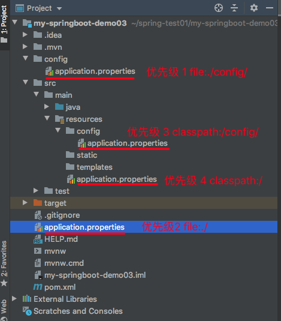

# Spring boot

- 简化Spring应用开发的一个框架； 
- 整个Spring技术栈的一个大整合； 
- J2EE开发的一站式解决方案； 

```java
@SpringBootApplication
public class StudyApplication {
    public static void main(String[] args) {
        SpringApplication.run(StudyApplication.class, args);
    }
}
```


## 基础

### 自动配置原理

```java
@SpringBootApplication //标注主配置类
-@SpringBootConfiguration//封装了@Configuration，配置类并注入容器
--@Configuration
-@EnableAutoConfiguration//开启自动配置功能
--@AutoConfigurationPackage//扫描主配置类包及子包下的类
---@Import(AutoConfigurationPackages.Registrar.class)
--@Import(AutoConfigurationImportSelector.class)//导入自动配置选择器，扫描所有jar包下 `META-INF` 目录下的 `spring.factories` 文件
-@ComponentScan(excludeFilters =...)//扫描时排除策略
```

#### 概述

自动配置需要解三个问题：

- 满足什么样的**条件**？
- 创建**哪些** `Bean`？
- 创建的`Bean`的**属性**？

在我们引入 `spring-boot-starter-web` 依赖，会创建一个 8080 端口的内嵌 `Tomcat`，同时可以在 `application.yaml` 配置文件中通过 `server.port` 配置项自定义端口。那么这三个问题的答案如下：

- 满足什么样的**条件**：引入了 `spring-boot-starter-web` 依赖。
- 创建**哪些** Bean：内嵌的 Tomcat Bean。
- 创建的 Bean 的**属性**：在`application.yaml` 配置文件配置，具体配置项可看`ServerProperties`类。

```java
@Configuration // <1.1> 声明这是一个 Spring 配置类
@ConditionalOnWebApplication // <2.1>
@EnableConfigurationProperties(ServerProperties.class) // <3.1>
public class  EmbeddedWebServerFactoryCustomizerAutoConfiguration {

	@Configuration // <1.2>
	@ConditionalOnClass({ Tomcat.class, UpgradeProtocol.class })
	public static class TomcatWebServerFactoryCustomizerConfiguration {
		@Bean //声明该方法创建一个 Spring Bean
		public TomcatWebServerFactoryCustomizer tomcatWebServerFactoryCustomizer(
				Environment environment, ServerProperties serverProperties) {
			// <3.2>
			return new TomcatWebServerFactoryCustomizer(environment, serverProperties);
		}
	}
	......
}

```

通过 `@Configuration` 注解的配置类`XXXXAutoConfiguration`，可以解决“创建哪些 Bean”的问题。

> Spring Boot 的`spring-boot-autoconfigure`项目，提供了大量框架的自动配置类。

通过`@Configuration`条件注解，可以解决“满足什么样的条件”的问题。

> Spring Boot 的 `condition`包下，提供了大量的条件注解。

通过`@EnableConfigurationProperties`注解，让 `XXXXProperties` 配置属性类生效（注入容器），可以解决“创建的 Bean 的属性”的问题。

```java
@ConfigurationProperties(prefix = "server", ignoreUnknownFields = true)
public class ServerProperties
		implements EmbeddedServletContainerCustomizer, EnvironmentAware, Ordered {
	private Integer port;
	private String contextPath;
	// ... 省略其它属性
}
```

> 通过 `@ConfigurationProperties` 注解，声明将 `xxxx` 前缀的配置项，设置到 `XXXXProperties `配置属性类中。

#### 自动配置类

在 Spring Boot 的`spring-boot-autoconfigure`项目，提供了大量框架的自动配置。


在我们通过 `SpringApplication#run()`方法，启动 Spring Boot 应用的时候，有个非常重要的组件`SpringFactoriesLoader` 类，会读取每个jar包 `META-INF` 目录下的 `spring.factories` 文件，获得**每个框架定义的需要自动配置的配置类**。


如此，原先 `@Configuration` 注解的配置类，就**升级**成类自动配置类。这样，Spring Boot 在获取到需要自动配置的配置类后，就可以自动创建相应的 Bean，完成自动配置的功能。

#### 条件注解

条件注解并非 Spring Boot 独有，而是在 Spring3.1 版本时，为了满足不同环境注册不同的 `Bean `，引入了`@Profile`注解。

```java
@Configuration
public class DataSourceConfiguration {
    @Bean
    @Profile("DEV")//在测试环境下，我们注册单机 MySQL 的 DataSource Bean。
    public DataSource devDataSource() {
        // ... 单机 MySQL
    }
    
    @Bean
    @Profile("PROD")//在生产环境下，我们注册集群 MySQL 的 DataSource Bean。
    public DataSource prodDataSource() {
        // ... 集群 MySQL
    }
}
```

在 Spring4 版本时，提供了 `@Conditional`注解，用于声明在配置类或者创建  `Bean ` 的方法上，表示需要满足指定条件才能生效。

```java
@Configuration
public class TestConfiguration {
    @Bean
    @Conditional(XXXCondition.class)//XXXCondition 需要我们自己实现 Condition 接口，提供具体的条件实现。
    public Object xxxObject() {
        return new Object();
    }
}
```

Spring Boot 进一步增强，提供了常用的条件注解：

- `@ConditionalOnBean`：当容器里有指定 Bean 的条件下
- `@ConditionalOnMissingBean`：当容器里没有指定 Bean 的情况下
- `@ConditionalOnSingleCandidate`：当指定 Bean 在容器中只有一个，或者虽然有多个但是指定首选 Bean
- `@ConditionalOnClass`：当类路径下有指定类的条件下
- `@ConditionalOnMissingClass`：当类路径下没有指定类的条件下
- `@ConditionalOnProperty`：指定的属性是否有指定的值
- `@ConditionalOnResource`：类路径是否有指定的值
- `@ConditionalOnExpression`：基于 SpEL 表达式作为判断条件
- `@ConditionalOnJava`：基于 Java 版本作为判断条件
- `@ConditionalOnJndi`：在 JNDI 存在的条件下差在指定的位置
- `@ConditionalOnNotWebApplication`：当前项目不是 Web 项目的条件下
- `@ConditionalOnWebApplication`：当前项目是 Web项 目的条件下

#### 配置属性

Spring Boot 约定读取 `application.yaml`、`application.properties` 等配置文件，从而实现创建 Bean 的自定义属性配置，甚至可以搭配 `@ConditionalOnProperty` 注解来取消 Bean 的创建。

#### 内置starter

我们在使用 Spring Boot 时，并不会直接引入 [`spring-boot-autoconfigure`](https://mvnrepository.com/artifact/org.springframework.boot/spring-boot-autoconfigure) 依赖，而是使用 Spring Boot 内置提供的 Starter 依赖。例如说，我们想要使用 SpringMVC 时，引入的是 [`spring-boot-starter-web`](https://mvnrepository.com/artifact/org.springframework.boot/spring-boot-starter-web) 依赖。

因为 Spring Boot 提供的自动配置类，基本都有 `@ConditionalOnClass` 条件注解，判断我们项目中存在指定的类，才会创建对应的 Bean。而拥有指定类的前提，一般是需要我们引入对应框架的依赖。

因此，在我们引入 `spring-boot-starter-web` 依赖时，它会帮我们自动引入相关依赖，从而保证自动配置类能够生效，创建对应的 Bean

Spring Boot 内置了非常多的 Starter，方便我们引入不同框架，并实现自动配置。

#### 自定义starter

在一些场景下，我们需要自己实现自定义 Starter 来达到自动配置的目的。例如说：

- 三方框架并没有提供 Starter，比如说 [Swagger](https://github.com/swagger-api)、[XXL-JOB](https://github.com/xuxueli/xxl-job) 等。
- Spring Boot 内置的 Starter 无法满足自己的需求，比如说 [`spring-boot-starter-jdbc`](https://mvnrepository.com/artifact/org.springframework.boot/spring-boot-starter-jdbc) 不提供多数据源的配置。
- 随着项目越来越大，想要提供适合自己团队的 Starter 来方便配置项目，比如说永辉彩食鲜 [csx-bsf-all](https://gitee.com/yhcsx/csx-bsf-all) 项目。

| 场景                         | 命名规则                            | 示例                                       |
| -------------------------- | ------------------------------- | ---------------------------------------- |
| **Spring Boot 内置** Starter | `spring-boot-starter-{框架}`      | `spring-boot-starter-web`                |
| 框架 **自定义** Starter         | `{框架}-spring-boot-starter`      | [`mybatis-spring-boot-starter`](https://mvnrepository.com/artifact/org.mybatis.spring.boot/mybatis-spring-boot-starter) |
| 公司 **自定义** Starter         | `{公司}-spring-boot-starter-{框架}` |                                          |

重点是：

- 创建`XXXXAutoConfiguration`配置类；
- 创建`XXXXProperties`属性 包装类，并通过`@ConfigurationProperties(prefix = "xxxx")`映射配置文件；
- 在 `resources` 目录下创建，创建 `META-INF` 目录，然后在该目录下创建 [`spring.factories`](https://github.com/YunaiV/SpringBoot-Labs/blob/master/lab-47/yunai-server-spring-boot-starter/src/main/resources/META-INF/spring.factories) 文件，添加自动化配置类为 `XXXXAutoConfiguration`；

## 开发工具

### lombok

[Lombok](https://github.com/rzwitserloot/lombok) 是一个 Java 工具，通过使用其定义的注解，自动生成常见的冗余代码，提升开发效率。

Lombok 的注解非常多，我们逐个来看看。

- @Getter 注解，添加在类或属性上，生成对应的 get 方法。
- @Setter 注解，添加在类或属性上，生成对应的 set 方法。
- @ToString 注解，添加在类上，生成 toString 方法。
- @EqualsAndHashCode 注解，添加在类上，生成 equals 和 hashCode 方法。
- @AllArgsConstructor、@RequiredArgsConstructor、@NoArgsConstructor 注解，添加在类上，为类自动生成对应参数的构造方法。
- @Data 注解，添加在类上，是 5 个 Lombok 注解的组合。
- @CommonsLog、@Flogger、@Log、@JBossLog、@Log4j、@Log4j2、@Slf4j、@Slf4jX 注解，添加在类上，自动为类添加对应的日志支持。
- @Builder 注解，添加在类上，给该类加个构造者模式 Builder 内部类。
- @Synchronized 注解，添加在方法上，添加同步锁。
- @SneakyThrows 注解，添加在方法上，给该方法添加 try catch 代码块。
- @NonNull 注解，添加在方法参数、类属性上，用于自动生成 null 参数检查。若确实是 null 时，抛出 NullPointerException 异常。

常用@Data、@Slf4j、@Builder、@SneakyThrows、@NonNull。

```java
//源码
@SneakyThrows
public static void tryCatch(@NonNull String name, @NonNull String age{}

//编译后
public static void tryCatch(@NonNull String name, @NonNull String age) {
    try {
        if (name == null) {
            throw new NullPointerException("name is marked non-null but is null");
        } else if (age == null) {
            throw new NullPointerException("age is marked non-null but is null");
        }
    } catch (Throwable var3) {
        throw var3;
    }
}、
```

### MapStruct 

`MapSturct` 是一个生成类型安全， 高性能且无依赖的 JavaBean 映射代码的注解处理器。

```java
@Mapper
public interface TargetMapper {
    TargetMapper INSTANCE = Mappers.getMapper(TargetMapper.class);
    @Mappings(value={
	@Mapping(target="abc", source="cba"),
	@Mapping(target="acc", source="cca", qualifiedByName="mapMethodName2"), //定义转换的方法
	@Mapping(target="aaa",  constant="123")  //定义常量	})
    Target source2target(Source source);
}
```

概述：

- 支持maven/gradle/ant工具所构建的项目；
- 在某些情况下，可能需要手动实现从一种类型到另一种类型的特定映射，而MapStruct无法生成这种映射，你可以向映射器中**添加自定义方法**；
- 可以用**多个源对象的数据映射到一个对象**上，也就是说可以同时把A和B的数据复制到C对象中；
- 可以通过引用更新目标对象，默认在复制时会生成新的对象并返回，但有时候可能不需要生成新的对象，只希望它在既有对象上进行复制；
- Bean的字段如果没有提供getter/setter方法也可以进行复制，它会通过实例直接访问属性来达到目的；
- 如果Bean提供了自己的工厂，即通过Builder构造自己，也可以被识别到；
- 获取映射器之后客户端才能调用，获取的方式支持Mappers工厂、CDI依赖注入和Spring依赖注入；
- **类型隐式转换**；
- **嵌套对象自动映射**；
- 在当前映射器中可以调用其他映射器，可以是自定义映射器；
- **集合映射**；
- 流映射；
- 枚举类映射；
- **映射字段控制**：常量，默认值，忽略字段，NULL值检查和处理策略，异常处理；
- 映射配置共享、继承和反向映射；
- 装饰器映射，也就是在映射前后做一些自定义操作；
- 提供SPI接口，可以修改框架的部分实现；

## web开发

### spring MVC

`spring-boot-starter-web`实现 SpringMVC 的自动化配置

#### 注解

- `@Controller`
- `@RestController` 是 `@Controller` 和 `@ResponseBody` 的组合注解。
- `@RequestMapping`
- `@GetMapping`
- `@PostMapping`
- `@PutMapping`
- `@RequestParam` 
- `@PathVariable` 

#### 全局统一返回

一般来说，统一的全局返回信息如下：

- 成功时，返回**成功的状态码** + **数据**。
- 失败时，返回**失败的状态码** + **错误提示**。

在全局统一返回里，我们至少需要定义三个字段：

- `code`：状态码。无论是否成功，必须返回。

> 成功时，状态码为 0 。
>
> 失败时，对应业务的错误码。

- `data`：数据。成功时，返回该字段。
- `message`：错误提示。失败时，返回该字段。

在 `Spring MVC `中，可以使用通过实现 `ResponseBodyAdvice `接口，并添加 `@ControllerAdvice`接口，拦截 `Controller `的返回结果。

```java
//只拦截 Controller 所在包，避免其它类似 swagger 提供的 API 被切面拦截
@ControllerAdvice(basePackages = "com.study.dxbm.controller")
public class GlobalResponseBodyHandler implements ResponseBodyAdvice {
    @Override
    public boolean supports(MethodParameter methodParameter, Class aClass) {
        return true;//true表示拦截 Controller 所有 API 接口的返回结果。
    }

    @Override
    public Object beforeBodyWrite(Object body, MethodParameter methodParameter, MediaType mediaType, Class aClass, ServerHttpRequest serverHttpRequest, ServerHttpResponse serverHttpResponse) {
        // 如果已经是 CommonResult 类型，则直接返回
        if (body instanceof CommonResult) {
            return body;
        }
        // 如果不是，则包装成 CommonResult 类型
        return CommonResult.success(body);
    }
}
```

在项目中，我们可能会引入 `Swagger `等库，也使用 Controller 提供 API 接口，那么我们显然不应该让 `GlobalResponseBodyHandler `去拦截这些接口，**毕竟它们并不需要我们去替它们做全局统一的返回**。

API 接口既然返回结果被拦截到，**约定**就是成功返回，所以使用 `CommonResult#success` 方法，进行包装成**成功**的 `CommonResult `返回。那么，如果我们希望 API 接口是**失败**的返回呢？我们**约定**在 Controller 抛出异常。

`ResponseBodyAdvice `用于对响应内容 Response Body 进行切面拦截。而相对的，Spring MVC 也提供了 `RequestBodyAdvice `，用于对请求内容 Request Body 进行切面拦截。

#### 全局异常处理


## hello word

**pom文件：**

```xml
//父级项目
<parent>
        <groupId>org.springframework.boot</groupId>
        <artifactId>spring-boot-starter-parent</artifactId>
        <version>2.2.7.RELEASE</version>
        <relativePath/> <!-- lookup parent from repository -->
 </parent>

//依赖starter
<dependencies>
        <dependency>
            <groupId>org.springframework.boot</groupId>
            <artifactId>spring-boot-starter-web</artifactId>
        </dependency>
</dependencies>

//插件
 <build>
        <plugins>
            <plugin>
                <groupId>org.springframework.boot</groupId>
                <artifactId>spring-boot-maven-plugin</artifactId>
            </plugin>
        </plugins>
  </build>

```

**程序入口：**

```java
@SpringBootApplication
public class StudyApplication {
    public static void main(String[] args) {
        SpringApplication.run(StudyApplication.class, args);
    }
}
```

**controller：**

```java
@RestController
@RequestMapping("/test")
public class HelloController {
    @RequestMapping("/hello")
    public String hello(){
        return "hello word...";
    }
}
```

**执行：**

```java
直接执行main方法；
通过maven package 打成jar包，通过java -jar jar包；
```

## 探究

- 父级项目


spring‐boot‐starter‐parent的父级项目是spring‐boot‐dependencies，Spring Boot的版本仲裁中心，管理Spring Boot应用里面的所有依赖版本。

> 以后我们导入依赖默认是不需要写版本的；
>
> 没有在spring‐boot‐dependencies里面管理的依赖是需要声明版本号的；

- stater

场景启动器，Spring Boot将所有的功能场景都抽取出来，做成一个个的starter（启动器）。只需要在项目里面引入这些starter，相关场景的所有依赖都会导入进来。

如：spring‐boot‐starter‐web，帮我们导入了web模块正常运行所依赖的组件。

- 入口类

@SpringBootApplication：标注在某个类上，说明这个类是SpringBoot的主配置类，可通过main方法来启动SpringBoot应用。

```java
@Target(ElementType.TYPE)
@Retention(RetentionPolicy.RUNTIME)
@Documented
@Inherited
@SpringBootConfiguration
@EnableAutoConfiguration
@ComponentScan(excludeFilters = { 
  @Filter(type = FilterType.CUSTOM, classes = TypeExcludeFilter.class),
  @Filter(type = FilterType.CUSTOM, classes = AutoConfigurationExcludeFilter.class) })
public @interface SpringBootApplication {
  .....
}
```

其中：

**@SpringBootConfifiguration**：标注在某个类上，表示该类是Spring Boot的配置类。

> 其实就是对@Confifiguration的进一步封装；
>
> 相当于配置文件中的<beans/>节点；
>
> 配置类会注册到spring容器中，@Component

```java
@Target({ElementType.TYPE})
@Retention(RetentionPolicy.RUNTIME)
@Documented
@Configuration
public @interface SpringBootConfiguration {
  .....
}

@Target({ElementType.TYPE})
@Retention(RetentionPolicy.RUNTIME)
@Documented
@Component
public @interface Configuration {
 .... 
}
```

**@ComponentScan**：自动扫描指定包下所有使用@Service,@Component,@Controller,@Repository等注解的类并注册到容器中。

> Value：指定要扫描的包；
>
> excludeFilters：指定扫描的时候按照什么规则排除哪些组件，值是@Filter[]；
>
> includeFilters：指定扫描的时候只需要包含哪些组件，值是@Filter[]；
>
> useDefaultFilters：是否使用默认的过滤规则，默认为true，扫描所有类。若使用了includeFilters属性，则此属性需设值为false。

**@EnableAutoConfiguration**：开启自动配置功能。

```java
@Target(ElementType.TYPE)
@Retention(RetentionPolicy.RUNTIME)
@Documented
@Inherited
@AutoConfigurationPackage
@Import(AutoConfigurationImportSelector.class)
public @interface EnableAutoConfiguration {
 ..... 
}
```

@AutoConfigurationPackage：**添加该注解的类所在的package** 作为 **自动配置package** 进行管理。

```
@Target(ElementType.TYPE)
@Retention(RetentionPolicy.RUNTIME)
@Documented
@Inherited
@Import(AutoConfigurationPackages.Registrar.class)
public @interface AutoConfigurationPackage {

}
```

重点是@Import(AutoConfigurationPackages.Registrar.class)，Spring的底层注解@Import：快速给容器中导入组件。

AutoConfifigurationPackages.Registrar.class，将主配置类（@SpringBootApplication标注的类）所在包及下面所有子包的所有组件扫描到Spring容器。

也就是说当SpringBoot应用启动时默认会将启动类所在的package作为自动配置的package。

**@Import(AutoConfigurationImportSelector.class)：导入组件的选择器**。

该选择器是将所有需要导入的组件以全类名的方式返回，这些组件会被添加到容器中。会给容器导入非常多的自动配置类(xxxAutoConfiguration)，就是给容器中导入这个场景所有的组件，并配置好这些组件。

```java
public class AutoConfigurationImportSelector
		implements DeferredImportSelector, BeanClassLoaderAware, ResourceLoaderAware,
		BeanFactoryAware, EnvironmentAware, Ordered {
	.....
	@Override
	public String[] selectImports(AnnotationMetadata annotationMetadata) {
		if (!isEnabled(annotationMetadata)) {
			return NO_IMPORTS;
		}
		try {
			AutoConfigurationMetadata autoConfigurationMetadata = AutoConfigurationMetadataLoader
					.loadMetadata(this.beanClassLoader);
			AnnotationAttributes attributes = getAttributes(annotationMetadata);
			List<String> configurations = getCandidateConfigurations(annotationMetadata,
					attributes);
			configurations = removeDuplicates(configurations);
			configurations = sort(configurations, autoConfigurationMetadata);
			Set<String> exclusions = getExclusions(annotationMetadata, attributes);
			checkExcludedClasses(configurations, exclusions);
			configurations.removeAll(exclusions);
			configurations = filter(configurations, autoConfigurationMetadata);
			fireAutoConfigurationImportEvents(configurations, exclusions);
			return StringUtils.toStringArray(configurations);
		}
		catch (IOException ex) {
			throw new IllegalStateException(ex);
		}
	}
}
```

重点是：

```java
List<String> configurations = getCandidateConfigurations(annotationMetadata,attributes);
```

获取到配置类的全类名数组，如下图：


底层是通过：

```java
SpringFactoriesLoader.loadFactoryNames(EnableAutoConfiguration.class,classLoader)；
```

从类路径下的META-INF/spring.factories中获取EnableAutoConfifiguration指定的值，并将这些值作为自动配置类导入到容器中，自动配置类就生效，帮我们进行自动配置工作。

J2EE的整合解决方案和自动配置都在spring-boot-autoconfifigure-2.6.6 RELEASE.jar的META-INF/spring.factories中：


## 配置文件

resources文件夹中目录结构：

- static：保存所有的静态资源，如 js css images；


- templates：保存所有的模板页面，Spring Boot默认使用嵌入式的Tomcat，故不支持JSP页面，可以使用模板引擎（freemarker、thymeleaf）；


- application.properties：Spring Boot应用的配置文件，可以修改一些默认设置；

SpringBoot使用一个全局的配置文件，配置文件名是固定的：

- application.properties


- application.yml

配置文件的作用：修改SpringBoot自动配置的默认值。

### YAML语法

- 大小写敏感
- 使用缩进表示层级关系
- 缩进不允许使用tab，只允许空格
- 缩进的空格数不重要，只要相同层级的元素左对齐即可
- '#'表示注释

### 数据类型

纯量和数组的key代表的是类中的成员变量，对象的key代表的是类中的成员变量，key1...代表的是成员对象中的成员变量。

- 纯量

包括字符串、布尔值、整数、浮点数、Null、时间、日期。

使用冒号结构表示 **key: value**，冒号后面要加一个空格。

> ""：双引号不会转义字符串里面的特殊字符，如name: "zhangsan \n lisi"：输出；zhangsan 换行 lisi；
>
> ''：单引号会转义特殊字符如name: ‘zhangsan \n lisi’：输出；zhangsan \n lisi；

- 数组（List或Set）

以 - 开头的行表示构成一个数组。

```
key:
‐ value1
‐ value2
‐ value3
行内写法：
key: [value1,value2,value3]
```

- 对象（Map或Object）

对象键值对使用冒号结构表示 **key: value**，冒号后面要加一个空格。

也可以使用 **key:{key1: value1, key2: value2, ...}**。

还可以使用缩进表示层级关系。

```
常用写法：
key: 
    child-key: value
    child-key2: value2
行内写法：
key:{child-key: value, child-key2: value2}
```

### 配置文件读取

- @Value


```yaml
#application.yml配置
#value 获取配置信息
valueParam1:
 name: valuevalue1
valueParam2: valuevalue2
```

```java
@Data
@Component//注意此处，需要注入到容器中
public class ValuePojo {
    @Value("${valueParam1.name}")
    private String valueParam1;

    @Value("${valueParam2}")
    private String valueParam2;
}
```

- @PropertySource+@Valuel

若不使用默认的配置文件，即application.properties、application.yml，则可以使用@PropertySource指定配置文件。

@PropertySource不支持读取 .yml 文件。

```yaml
#test.properties配置
#value 获取配置信息
valueParam1.name=valuevalue1
valueParam2=valuevalue2
```

```java
@Data
@Component
@PropertySource(value = {"classpath:test.properties"})//注意路径写法
public class ValuePojo {
    @Value("${valueParam1.name}")
    private String valueParam1;

    @Value("${valueParam2}")
    private String valueParam2;
}
```

- @ConfigurationProperties

```yaml
#application.yml文件
person:
  lastName: hello
  age: 18
  boss: false
  birth: 2017/12/12
  maps: {k1: v1,k2: v2}
  lists:
    - lisi
    - zhaoliu
  dog:
    name: 小狗
    age: 12
```

```java
@Data
@ConfigurationProperties(prefix = "person")//映射配置文件中前缀为person的配置信息，默认映射全局文件
@Component//需要注入到容器中
public class Person {
    private String lastName;
    private Integer age;
    private Boolean boss;
    private Date birth;
    private Map<String, Object> maps;
    private List<Object> lists;
    private Dog dog;
}

@Data
class Dog {
    private String name;
    private String age;
}
```

- @PropertySource+@ConfigurationProperties

道理和@PropertySource+@Value一样，可以参考下。

> 如果说，我们只是在某个业务逻辑中需要获取一下配置文件中的某项值，使用@Value； 
>
> 如果说，我们专门编写了一个javaBean来和配置文件进行映射，我们就直接使用@ConfifigurationProperties； 

**注意**：

- 如果@ConfigurationProperties所注的类可以被springboot扫描并添加进容器中作为bean（比如使用@Component等注解，或者配置扫描该类所在包等手段），那么spring容器会自动使该类上的@ConfigurationProperties生效，创建一个该类的实例，然后把对应配置属性绑定进该实例，再把该实例作为bean添加进spring容器。
- 如果该类只使用了@ConfigurationProperties注解，然后该类没有在扫描路径下或者没有使用@Component等注解，导致无法被扫描为bean，那么就必须在配置类上使用@EnableConfigurationProperties注解去指定这个类，这个时候就会让该类上的@ConfigurationProperties生效，然后作为bean添加进spring容器中

- 在javaconfig中@ConfigurationProperties与@Bean一起用，也是把配置文件中的属性注入该@Bean对应的要添加到容器中的bean实例中。

### 配置文件加载位置

分别从以下四个位置依次读取后缀名为properties, xml, yml, yaml的配置文件：

```yaml
-file:./config/
 -file:./
  -classpath:/config
   -classpath:/
```

- 优先级由高到低，对于相同的属性配置，高优先级的配置会覆盖优先级低的配置；
- 对于其他不同的属性配置，则会进行互补；
- 优先级相同的情况下，同时有application.properties和application.yml，那么application.properties里面的属性就会覆盖application.yml里的属性，因为properties比yml优先加载；



> 还可以通过spring.confifig.location来改变默认的配置文件位置 

### 外部配置加载顺序

spring boot不仅可以从工程的resource文件夹或者config文件夹下加载配置，还可以在以下位置加载配置：

    命令行参数
    来自java:comp/env的JNDI属性
    Java系统属性(System.getProperties())
    操作系统环境变量
    RandomValuePropertyResource配置的random.*属性值
    jar包外部的application-{profile}.properties或application.yaml（带spring.profile）配置文件
    jar包内部的application-{profile}.properties或application.yaml（带spring.profile）配置文件
    jar包外部的application.properties或application.yaml（不带spring.profile）配置文件
    jar包内部的application.properties或application.yaml（不带spring.profile）配置文件
    @Configuration注解类上的@PropertySource
    通过SpringApplication.setDefaultProperties指定的默认属性

其中上述中的6-9是我们需要重点掌握内容，从上向下优先级越来越低，高优先级的配置会覆盖低优先级的配置，高优先级的配置和低优先级的配置都会生效，形成互补配置。

## 多环境配置 profile

一个应用为了在不同的环境下工作，常常会有不同的配置，代码逻辑处理。Spring Boot 对此提供了简便的支持。假设，一个应用的工作环境有：dev、test、prod。

### properties 配置

- `applcation.properties` - 公共配置
- `application-dev.properties` - 开发环境配置
- `application-test.properties` - 测试环境配置
- `application-prod.properties` - 生产环境配置

在 `applcation.properties` 文件中可以通过以下配置来激活 profile：

```yaml
spring.profiles.active = test
```

### yml 配置

与 properties 文件类似，我们也可以添加 4 个配置文件：

- `applcation.yml` - 公共配置
- `application-dev.yml` - 开发环境配置
- `application-test.yml` - 测试环境配置
- `application-prod.yml` - 生产环境配置

在 `applcation.yml` 文件中可以通过以下配置来激活 profile：

```yaml
spring:
  profiles:
    active: prod #此处的值与application-{xxx}的xxx一样
```

此外，yml 文件也可以在一个文件中完成所有 profile 的配置：

```yaml
# 激活 prod
spring:
  profiles:
    active: prod
# 也可以同时激活多个 profile
# spring.profiles.active: prod,proddb,prodlog
---
# dev 配置
spring:
  profiles: dev
# 略去配置
---
# test 配置
spring:
  profiles: test
# 略去配置
---
# prod 配置
spring：
  profiles: prod
# 略去配置
```

注意：不同 profile 之间通过 `---` 分割。

使用 `@Profile` 注解可以指定类或方法在特定的 Profile 环境生效，如：@Profile("production")。

### 激活

在配置文件中指定 spring.profifiles.active=dev；

命令行： java -jar xxxxx.jar --spring.profifiles.active=dev； 

## 自动配置原理

```java
SpringBoot启动的时候加载主配置类，@EnableAutoConfifiguration 开启了自动配置功能；
利用AutoConfigurationImportSelector（自动配置导入选择器），扫描所有jar包下 META‐INF/spring.factories文件；
把文件的内容包装成Properties对象 ，从Properties中获取到EnableAutoConfiguration.class类对应的值（xxxAutoConfiguration类），然后把他们添加在到容器中。 
通过这些xxxAutoConfiguration类，根据@Conditional条件来进行自动配置功能；
```

以HttpEncodingAutoConfifiguration（Http编码自动配置）为例：

```java
//表示这是一个配置类，并添加到容器中
@Configuration(proxyBeanMethods = false)
//启动HttpProperties类的 ConfigurationProperties功能，并将HttpProperties类添加到容器
//HttpProperties属性类，与配置文件映射
@EnableConfigurationProperties(HttpProperties.class)
//条件注解
@ConditionalOnWebApplication(type = ConditionalOnWebApplication.Type.SERVLET)
@ConditionalOnClass(CharacterEncodingFilter.class)
@ConditionalOnProperty(prefix = "spring.http.encoding", value = "enabled", matchIfMissing = true)
public class HttpEncodingAutoConfiguration {

	private final HttpProperties.Encoding properties;//属性类，与配置文件映射

	public HttpEncodingAutoConfiguration(HttpProperties properties) {
		this.properties = properties.getEncoding();
	}

	@Bean
	@ConditionalOnMissingBean//条件成立，则注入组件CharacterEncodingFilter
	public CharacterEncodingFilter characterEncodingFilter() {
		CharacterEncodingFilter filter = new OrderedCharacterEncodingFilter();
		filter.setEncoding(this.properties.getCharset().name());
		filter.setForceRequestEncoding(this.properties.shouldForce(Type.REQUEST));
		filter.setForceResponseEncoding(this.properties.shouldForce(Type.RESPONSE));
		return filter;
	}
}
```

```
@ConfigurationProperties(prefix = "spring.http")//配置文件中前缀为spring.http的配置
public class HttpProperties {
	....//省略属性
}
```

> 根据当前不同的条件判断，决定这个配置类是否生效。
>
> 若这个配置类生效，就会给容器中添加各种组件。这些组件的属性是从对应的XXXProperties类中获取的，这些XXXProperties类里面的每一个属性又是和配置文件绑定的。
>
> 所以，配置文件能配置什么就可以参照某个功能对应的XXXProperties类 。

@Conditional派生注解，必须是指定的条件成立，才给容器中添加组件，配置配里面的所有内容才生效，如下：

| @Conditional扩展注解                | 作用（判断是否满足当前指定条件）               |
| :------------------------------ | :----------------------------- |
| @ConditionalOnJava              | 系统的java版本是否符合要求                |
| @ConditionalOnBean              | 容器中存在指定Bean                    |
| @ConditionalOnMissingBean       | 容器中不存在指定Bean                   |
| @ConditionalOnExpression        | 满足SpEL表达式指定                    |
| @ConditionalOnClass             | 系统中有指定的类                       |
| @ConditionalOnMissingClass      | 系统中没有指定的类                      |
| @ConditionalOnSingleCandidate   | 容器中只有一个指定的Bean，或者这个Bean是首选Bean |
| @ConditionalOnProperty          | 系统中指定的属性是否有指定的值                |
| @ConditionalOnResource          | 类路径下是否存在指定资源文件                 |
| @ConditionalOnWebApplication    | 当前是web环境                       |
| @ConditionalOnNotWebApplication | 当前不是web环境                      |
| @ConditionalOnJndi              | JNDI存在指定项                      |

小知识：

```yaml
debug: true #让控制台打印自动配置报告，这样我们就可以很方便的知道哪些自动配置类生效
```

# 日志框架

市面上的日志框架：

| 日志门面 （日志的抽象层）                            | 日志实现                                     |
| :--------------------------------------- | ---------------------------------------- |
| ~~JCL（Jakarta Commons Logging）~~ 、SLF4j（Simple Logging Facade for Java）、 ~~jboss-logging~~ | Log4j、 JUL（java.util.logging）、 **Log4j2**、 **Logback** |

## SLF4j实现


**每一个日志的实现框架都有自己的配置文件，使用slf4j后，配置文件还是做成日志实现框架本身的配置文件。**

## 遗留问题

让系统中所有的日志都统一到slf4j：

- 先排除其他日志框架；
- 用中间包来替换原有的日志框架； 
- 导入slf4j其他的实现 ；


## SpringBoot日志

```
    <dependency>
      <groupId>org.springframework.boot</groupId>
      <artifactId>spring-boot-starter</artifactId>
      <version>2.2.7.RELEASE</version>
      <scope>compile</scope>
    </dependency>
    //中的
    <dependency>
      <groupId>org.springframework.boot</groupId>
      <artifactId>spring-boot-starter-logging</artifactId>
      <version>2.2.7.RELEASE</version>
      <scope>compile</scope>
    </dependency>
```

使用spring-boot-starter-logging来实现日志框架，底层关系如下：


> SpringBoot底层也是使用slf4j+logback的方式进行日志记录 ；
>
> SpringBoot通过中间替换包把其他的日志实现都替换成了slf4j； 

**如果我们要引入其他框架，一定要把这个框架的默认日志依赖移除掉**！例如Spring框架用的是commons-logging，SpringBoot是这样做的：

```xml
<dependency>
  <groupId>org.springframework</groupId>
  <artifactId>spring‐core</artifactId>
  <exclusions>
    <exclusion>
      <groupId>commons‐logging</groupId>
      <artifactId>commons‐logging</artifactId>
    </exclusion>
  </exclusions>
</dependency>
```

**SpringBoot能自动适配所有的日志，而且底层使用slf4j+logback的方式记录日志，引入其他框架的时候，只需要把这个框架依赖的日志框架排除掉即可。**

## lombak日志使用

可以在全局配置文件中配置，但Spring Boot官方推荐优先使用带有-spring的文件名作为日志配置（如使用logback-spring.xml，而不是logback.xml），命名为logback-spring.xml的日志配置文件，将xml放至 src/main/resource下面。

> 也可以使用自定义的名称，比如logback-config.xml，只需要在application.properties文件中使用logging.config=classpath:logback-config.xml指定即可。

logback-spring.xml配置可以使用spring boot的高级级Profifile功能，即指定在哪个环境使用。

例子：

```java
import org.slf4j.Logger;
import org.slf4j.LoggerFactory;
@SpringBootTest
public class LogTest {
    Logger logger = LoggerFactory.getLogger(getClass());
    @Test
    public void log(){
        //日志就只会在这个级别以后的高级别生效
        //trace<debug<info<warn<error      
        logger.trace("trace...");
        logger.debug("debug...");
        logger.info("info...");//默认
        logger.warn("warn...");
        logger.error("error...");
        logger.debug("The new entry is {}. It replaces {}.", entry, oldEntry);//推荐使用此格式
    }
}
```

xml:

```xml
<?xml version="1.0" encoding="UTF-8"?>
<!--
scan：当此属性设置为true时，配置文件如果发生改变，将会被重新加载，默认值为true。
scanPeriod：设置监测配置文件是否有修改的时间间隔，如果没有给出时间单位，默认单位是毫秒当scan为true时，此属性生效。默认的时间间隔为1分钟。
debug：当此属性设置为true时，将打印出logback内部日志信息，实时查看logback运行状态。默认值为false。
-->
<configuration scan="false" scanPeriod="60 seconds" debug="false">
    <!-- 定义日志的根目录 -->
    <property name="LOG_HOME" value="/app/log" />
    <!-- 定义日志文件名称 -->
    <property name="appName" value="atguigu-springboot"></property>
  
    <!-- ch.qos.logback.core.ConsoleAppender 表示控制台输出 -->
    <appender name="stdout" class="ch.qos.logback.core.ConsoleAppender">
        <!--
        日志输出格式：
			%d表示日期时间，
			%thread表示线程名，
			%-5level：级别从左显示5个字符宽度
			%logger{50} 表示logger名字最长50个字符，否则按照句点分割。 
			%msg：日志消息，
			%n是换行符
        -->
        <layout class="ch.qos.logback.classic.PatternLayout">
            <pattern>%d{yyyy-MM-dd HH:mm:ss.SSS} [%thread] %-5level %logger{50} - %msg%n</pattern>
        </layout>
    </appender>

    <!-- 滚动记录文件，先将日志记录到指定文件，当符合某个条件时，将日志记录到其他文件 -->  
    <appender name="appLogAppender" class="ch.qos.logback.core.rolling.RollingFileAppender">
        <!-- 指定日志文件的名称 -->
        <file>${LOG_HOME}/${appName}.log</file>
        <!--
        当发生滚动时，决定 RollingFileAppender 的行为，涉及文件移动和重命名
        TimeBasedRollingPolicy： 最常用的滚动策略，它根据时间来制定滚动策略，既负责滚动也负责出发滚动。
        -->
        <rollingPolicy class="ch.qos.logback.core.rolling.TimeBasedRollingPolicy">
            <!--
            滚动时产生的文件的存放位置及文件名称 %d{yyyy-MM-dd}：按天进行日志滚动 
            %i：当文件大小超过maxFileSize时，按照i进行文件滚动
            -->
            <fileNamePattern>${LOG_HOME}/${appName}-%d{yyyy-MM-dd}-%i.log</fileNamePattern>
            <!-- 
            可选节点，控制保留的归档文件的最大数量，超出数量就删除旧文件。假设设置每天滚动，
            且maxHistory是365，则只保存最近365天的文件，删除之前的旧文件。注意，删除旧文件是，
            那些为了归档而创建的目录也会被删除。
            -->
            <MaxHistory>365</MaxHistory>
            <!-- 
            当日志文件超过maxFileSize指定的大小是，根据上面提到的%i进行日志文件滚动 注意此处配置SizeBasedTriggeringPolicy是无法实现按文件大小进行滚动的，必须配置timeBasedFileNamingAndTriggeringPolicy
            -->
            <timeBasedFileNamingAndTriggeringPolicy class="ch.qos.logback.core.rolling.SizeAndTimeBasedFNATP">
                <maxFileSize>100MB</maxFileSize>
            </timeBasedFileNamingAndTriggeringPolicy>
        </rollingPolicy>
        <!-- 日志输出格式： -->     
        <layout class="ch.qos.logback.classic.PatternLayout">
            <pattern>%d{yyyy-MM-dd HH:mm:ss.SSS} [ %thread ] - [ %-5level ] [ %logger{50} : %line ] - %msg%n</pattern>
        </layout>
    </appender>

    <!-- 
		logger主要用于存放日志对象，也可以定义日志类型、级别
		name：表示匹配的logger类型前缀，也就是包的前半部分
		level：要记录的日志级别，包括 TRACE < DEBUG < INFO < WARN < ERROR
		additivity：作用在于children-logger是否使用 rootLogger配置的appender进行输出，
		false：表示只用当前logger的appender-ref，true：
		表示当前logger的appender-ref和rootLogger的appender-ref都有效
    -->
    <!-- hibernate logger -->
    <!-- z指定包级别的日志输出 -->
    <logger name="com.atguigu" level="debug" />
    <!-- Spring framework logger -->
    <logger name="org.springframework" level="debug" additivity="false"></logger>

    <!-- 
    root与logger是父子关系，没有特别定义则默认为root，任何一个类只会和一个logger对应，
    要么是定义的logger，要么是root，判断的关键在于找到这个logger，然后判断这个logger的appender和level。 
    -->
  <!-- 当spring.profiles.active为dev时激活 -->
    <!-- 参考‘Spring Boot：boot-features-logging’中的‘Profile-specific configuration’ -->
    <springProfile name="dev">
        <root level="INFO">
           <appender-ref ref="stdout" />
           <appender-ref ref="appLogAppender" />
        </root>
    </springProfile>

    <springProfile name="prod">
        <root level="INFO">
            <appender-ref ref="" />
        </root>
    </springProfile>
</configuration> 
```

利用kafak异步输出日志：https://www.zhangjianbing.com/archives/38/

# spring-boot-devtools

```xml
<dependency>
    <groupId>org.springframework.boot</groupId>
    <artifactId>spring-boot-devtools</artifactId>
    <optional>true</optional> <!-- 可选 -->
</dependency>=
```

`spring-boot-devtools` 是 `Spring Boot` 提供的开发者工具，它会监控当前应用所在的 `classpath` 下的文件发生变化，进行**自动重启**。

注意，`spring-boot-devtools` 并**没有**采用热部署的方式，而是一种较快的重启方式。其官方文档解释如下：

Spring Boot 通过使用两个类加载器来提供了重启技术。

- 不改变的类（例如，第三方 jar）被加载到 **base** 类加载器中。
- 经常处于开发状态的类被加载到 **restart** 类加载器中。

当应用重启时，**restart** 类加载器将被丢弃，并重新创建一个新的。这种方式意味着应用重启比**冷启动**要快得多，因为省去 **base** 类加载器的处理步骤，并且可以直接使用。

**【关键】** 我们现在仅仅需要修改了 Java 代码，需要重新编译下代码。点击 IDEA 的菜单 `Build` -> `Build Project`，**手动**进行编译。

# MapStruct对象转换

对于代码中 `JavaBean`之间的转换：

- 第一种通过反射的方法确实比较方便， 但是现在无论是 `BeanUtils`, `BeanCopier` 等在使用反射的时候都会影响到性能。
- 第二种的话就是会很浪费时间， 而且在添加新的字段的时候也要进行方法的修改。 不过， 由于不需要进行反射， 其性能是很高的。

`MapSturct` 是一个生成类型安全， 高性能且无依赖的 JavaBean 映射代码的注解处理器。

```xml
<dependency>
    <groupId>org.mapstruct</groupId>
    <artifactId>mapstruct-jdk8</artifactId>
    <version>1.3.1.Final</version>
</dependency>
<dependency>
    <groupId>org.mapstruct</groupId>
    <artifactId>mapstruct-processor</artifactId>
    <version>1.3.1.Final</version>
</dependency>
```

## 属性名称相同

只有一个要求， 在接口上写 `@Mapper` 注解即可。 然后方法上， 入参对应要被转化的对象， 返回值对应转化后的对象， 方法名称可任意。

```java
import org.mapstruct.Mapper;
import org.mapstruct.Mapping;
@Mapper
public interface TargetMapper {
    Target source2Target(Source source);
}
```

在 target/generated-sources/annotations 里可以看到通过 `MapStruct` 来生成的代码， 其类似于人手写，我们可以轻易的进行 debug。

## 属性名称不相同

属性名不相同， 在需要进行互相转化的时候， 则我们可以通过 `@Mapping` 注解来进行转化。

```java
    @Mapper
    public interface TargetMapper {
        TargetMapper INSTANCE = Mappers.getMapper(TargetMapper.class);
       @Mappings(value={
　　		@Mapping(target="abc", source="cba"),
　　		@Mapping(target="acc", source="cca", qualifiedByName="mapMethodName2"), //定义转换的方法
　　		@Mapping(target="aaa",  constant="123")  //定义常量
		})
        Target source2target(Source source);
    }
```

## 使用自定义的转换

```java
    @Mapper
    public interface TargetMapper {
        TargetMapper INSTANCE = Mappers.getMapper(TargetMapper.class);
        default Target source2target(Source source) {
            if (source == null) {
                return null;
            }
            Target target = new Target();
            ....
            return target;
        }
    }
```


## 多转一

```
    @Mapper
    public interface TargetMapper {
        TargetMapper INSTANCE = Mappers.getMapper(TargetMapper.class);
        @Mapping(source = "source1.para", target = "para")
        @Mapping(source = "source2.para", target = "para")
        Target sources2target(Source1 source1, Source2 source2);
    }
```

在多对一转换时， **遵循以下几个原则**

- 当多个对象中， 有其中一个为 null， 则会直接返回 null
- 如一对一转换一样， 属性通过名字来自动匹配。 因此， 名称和类型相同的不需要进行特殊处理
- 当多个原对象中，有相同名字的属性时，需要通过 `@Mapping` 注解来具体的指定， 以免出现歧义（不指定会报错）。 如上面的 `description`

## 更新 Bean 对象

有时候， 我们不是想返回一个新的 Bean 对象， 而是希望更新传入对象的一些属性。

```java
import org.mapstruct.Mapper;
import org.mapstruct.Mapping;
@Mapper
public interface TargetMapper {
    void updateSource(Source1 source1, @MappingTarget Source2 source2);
}
```

注解 `@MappingTarget`后面跟的对象会被更新。

## 总结

- 支持maven/gradle/ant工具所构建的项目；
- 在某些情况下，可能需要手动实现从一种类型到另一种类型的特定映射，而MapStruct无法生成这种映射，你可以向映射器中添加自定义方法；
- 可以用多个源对象的数据映射到一个对象上，也就是说可以同时把A和B的数据复制到C对象中；
- 可以通过引用更新目标对象，默认在复制时会生成新的对象并返回，但有时候可能不需要生成新的对象，只希望它在既有对象上进行复制；
- Bean的字段如果没有提供getter/setter方法也可以进行复制，它会通过实例直接访问属性来达到目的；
- 如果Bean提供了自己的工厂，即通过Builder构造自己，也可以被识别到；
- 获取映射器之后客户端才能调用，获取的方式支持Mappers工厂、CDI依赖注入和Spring依赖注入；
- 类型隐式转换；
- 嵌套对象自动映射；
- 在当前映射器中可以调用其他映射器，可以是自定义映射器；
- 集合映射；
- 流映射；
- 枚举类映射；
- 映射字段控制：常量，默认值，忽略字段，NULL值检查和处理策略，异常处理；
- 映射配置共享、继承和反向映射；
- 装饰器映射，也就是在映射前后做一些自定义操作；
- 提供SPI接口，可以修改框架的部分实现；

MapStruct 提供了 IDEA MapStruct Support 插件，让我们在 IDEA 中，可以更愉快的使用 MapStruct，牛逼啊！

